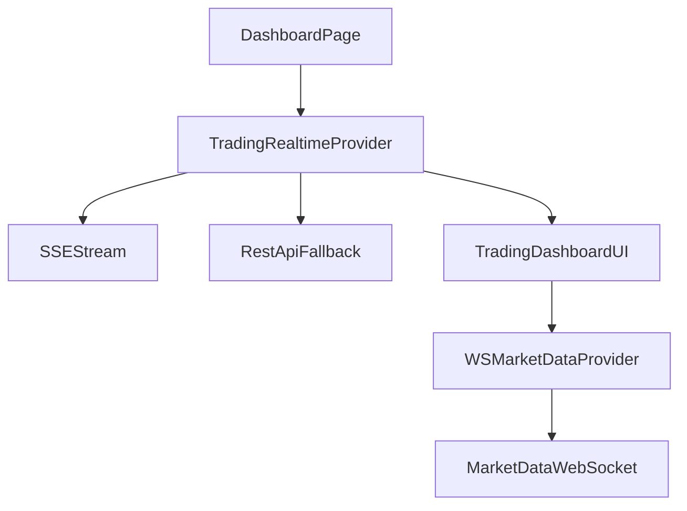

# Enterprise-grade `/dashboard` (Trading) Upgrade Plan

## Goals

- **Enterprise robustness**: resilient realtime updates (SSE/WS), predictable retries/backoff, graceful degradation when a subsystem fails.
- **Smooth UX**: fast perceived load, no jank, clear connection status, actionable errors, accessible navigation.
- **Replace TradingView embeds**: remove external script widgets and ship internal chart/ticker/heatmap equivalents.
- **Maintain debuggability**: keep rich diagnostics but avoid production log spam by routing logs through a controlled, structured layer.
- **Docs + flowcharts**: add module-local docs and reconcile existing docs with actual code.

## What I found (high-signal)

- `/dashboard` is served by `[app/(main)/dashboard/page.tsx](/home/amansharma/Desktop/DevOPS/tradingpro-platform/app/\\\(main)/dashboard/page.tsx) `which wraps `components/trading/TradingDashboard.tsx` in `ErrorBoundary`.
- `TradingDashboard` uses realtime SWR+SSE hooks (`useRealtimeOrders/Positions/Account`), while market-data subscriptions come from `WebSocketMarketDataProvider`, which currently pulls positions again via `usePositions` (GraphQL) causing **duplicate fetching + potential inconsistency**.
- Realtime hooks + SSE manager currently do **very chatty logging** and can **poll aggressively** when disconnected (3s loops + 1s connection-state polling), which can hurt performance and backend load.
- `TradingHome` has **dynamic Tailwind classes** (e.g., `text-${action.color}-600`) that commonly fail in production builds, and it injects multiple external widget scripts (which we’ll remove per your choice).
- There are **two logging systems** (`lib/logger.ts` GraphQL-based and `lib/services/logging/TradingLogger.ts` Prisma-based) that overlap; we should unify responsibilities.

## Implementation Plan (Full-stack + Replace TradingView)

### 1) Stabilize data + realtime architecture (reduce duplication, improve correctness)

- **Introduce a single “TradingRealtimeContext/Provider”** that owns:
  - `useRealtimeOrders`, `useRealtimePositions`, `useRealtimeAccount`
  - shared derived values (e.g., `tradingAccountId`, P&L calculations)
  - connection health summary (SSE state + WS state + last-updated timestamps)
- Update `WebSocketMarketDataProvider` to **consume instrument tokens from the unified trading context** (or accept tokens as prop from that provider) instead of refetching positions via GraphQL.
- Fix quote lookup consistency: always map `instrumentId -> token -> quotes[token] `using existing helpers in `lib/market-data/utils/instrumentMapper` so P&L/live prices don’t silently fall back.

**Primary files:**

- [`components/trading/TradingDashboard.tsx`](/home/amansharma/Desktop/DevOPS/tradingpro-platform/components/trading/TradingDashboard.tsx)
- [`lib/market-data/providers/WebSocketMarketDataProvider.tsx`](/home/amansharma/Desktop/DevOPS/tradingpro-platform/lib/market-data/providers/WebSocketMarketDataProvider.tsx)
- [`lib/hooks/use-realtime-orders.ts`](/home/amansharma/Desktop/DevOPS/tradingpro-platform/lib/hooks/use-realtime-orders.ts)
- [`lib/hooks/use-realtime-positions.ts`](/home/amansharma/Desktop/DevOPS/tradingpro-platform/lib/hooks/use-realtime-positions.ts)
- [`lib/hooks/use-realtime-account.ts`](/home/amansharma/Desktop/DevOPS/tradingpro-platform/lib/hooks/use-realtime-account.ts)

### 2) Make connection + polling enterprise-grade (backoff, pause on hidden tab, fewer loops)

- `useSharedSSE`:
  - Replace 1s polling with a **lower-frequency state probe** + `visibilitychange`/`online` event listeners.
  - Add **explicit last-event timestamp** and expose health info.
- Realtime hooks:
  - Replace fixed 3s poll-on-disconnect with **exponential backoff + jitter** and a ceiling.
  - Pause polling while `document.visibilityState === 'hidden'` (and resume with a single refresh on focus).
  - Ensure intervals are singletons per hook instance and never multiply.
- `WebSocketMarketDataProvider`:
  - Stop logging on every render; use a controlled logger and only log transitions.
  - Ensure subscription updates are diffed (already present) but remove dependency pitfalls like `wsData.getSubscriptionCount` in hook deps.

**Primary files:**

- [`lib/hooks/use-shared-sse.ts`](/home/amansharma/Desktop/DevOPS/tradingpro-platform/lib/hooks/use-shared-sse.ts)
- [`lib/market-data/providers/WebSocketMarketDataProvider.tsx`](/home/amansharma/Desktop/DevOPS/tradingpro-platform/lib/market-data/providers/WebSocketMarketDataProvider.tsx)

### 3) Upgrade UX for smoothness + trust (loading, partial failure, accessibility)

- Replace full-screen “error-or-nothing” with **section-level error boundaries**:
  - Orders tab can fail while Positions still works, etc.
- Add **skeletons** and “stale data” affordances:
  - show last update time, “reconnect” button, and read-only mode when disconnected.
- Fix layout risks (sticky header `w-screen` overflow) and add keyboard/a11y labels for bottom navigation.
- Improve auth UX: if session is missing, **redirect to login** (not infinite loading screen).

**Primary files:**

- `[app/(main)/dashboard/page.tsx](/home/amansharma/Desktop/DevOPS/tradingpro-platform/app/\\\(main)/dashboard/page.tsx)`
- [`components/error-boundary.tsx`](/home/amansharma/Desktop/DevOPS/tradingpro-platform/components/error-boundary.tsx)
- [`components/trading/TradingDashboard.tsx`](/home/amansharma/Desktop/DevOPS/tradingpro-platform/components/trading/TradingDashboard.tsx)

### 4) Replace TradingView widgets with in-app components

- Implement internal widgets under `components/trading/widgets/`:
  - **TickerBar**: lightweight horizontal ticker (quotes + a small curated list).
  - **PriceChart**: use existing `lightweight-charts` dependency for a responsive chart; support symbol selection.
  - **MarketHeatmap**: heatmap from available quotes/watchlist/indices (no external calls), with virtualization for larger lists.
  - **ScreenerLite**: simple filter/sort/search table powered by existing stock search functions.
- Remove TradingView script injection code from `TradingHome` and replace with these widgets.
- Fix Tailwind dynamic class usage by mapping to static class strings.

**Primary files:**

- [`components/trading/TradingHome.tsx`](/home/amansharma/Desktop/DevOPS/tradingpro-platform/components/trading/TradingHome.tsx)
- New: `components/trading/widgets/*`

### 5) Logging + observability without production spam (but still very debuggable)

- Create a **single client-safe logger wrapper** (e.g., `lib/logging/clientLogger.ts`) that:
  - writes to `console.*` (per your requirement)
  - supports levels + throttling + sampling
  - is controllable via `NEXT_PUBLIC_DEBUG_TRADING` and per-module namespaces
- Server/API:
  - Add a small `withApiTelemetry()` helper to time requests and log standardized structured events.
  - Unify logging direction: keep `lib/services/logging/TradingLogger.ts` for DB audit logs (Prisma) and use the client logger only for UI diagnostics.
  - Document when to use `lib/logger.ts` vs Prisma logger; likely deprecate one path to avoid duplicated logs.

**Primary files:**

- [`lib/services/logging/TradingLogger.ts`](/home/amansharma/Desktop/DevOPS/tradingpro-platform/lib/services/logging/TradingLogger.ts)
- [`lib/logger.ts`](/home/amansharma/Desktop/DevOPS/tradingpro-platform/lib/logger.ts)
- API routes under [`app/api/trading/`](/home/amansharma/Desktop/DevOPS/tradingpro-platform/app/api/trading)

### 6) Docs + flowcharts (module-local) and reconcile existing docs

- Add `components/trading/DOCS.md` (or `components/trading/docs/*.md`) containing:
  - dashboard data flow
  - realtime strategy (SSE + polling fallback + WS market data)
  - error handling matrix
  - how to debug (logs, feature flags)
  - **mermaid flowcharts**
- Update [`TRADING_SYSTEM_ARCHITECTURE.md`](/home/amansharma/Desktop/DevOPS/tradingpro-platform/TRADING_SYSTEM_ARCHITECTURE.md) to reflect the new dashboard architecture and removal of TradingView embeds.

Example mermaid (to be placed in module docs):

## Acceptance Criteria

- `/dashboard` loads with skeletons and becomes usable quickly; no “blank screen” while waiting.
- Disconnecting SSE/WS shows clear status + keeps last known data; reconnect works.
- No duplicated fetching for positions/orders/account across providers.
- TradingView external script widgets are removed; internal widgets render reliably.
- Logs are still rich for debugging but are **throttled/leveled** to avoid flooding.
- Docs in `components/trading/` match code and include flowcharts.

## Implementation Todos

- `dash-architecture`: Introduce `TradingRealtimeProvider` and refactor `TradingDashboard` to consume it
- `realtime-backoff`: Implement backoff/visibility-aware polling + improve `useSharedSSE` connection handling
- `marketdata-unify`: Remove duplicated positions fetch in `WebSocketMarketDataProvider` and unify token mapping
- `widgets-replace-tv`: Replace TradingView widgets with internal `TickerBar/PriceChart/MarketHeatmap/ScreenerLite`
- `ux-polish-a11y`: Add skeletons, partial-error UI, a11y labels, auth redirect behavior
- `logging-unify`: Add client logger wrapper + standardize API telemetry and reconcile logger duplication
- `docs-flowcharts`: Add module docs + update `TRADING_SYSTEM_ARCHITECTURE.md` to match reality