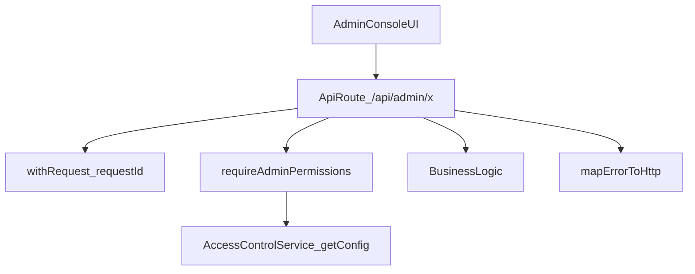

# RBAC + Access Control enterprise hardening (phase 2)

## What I verified (permission management correctness)

- **Server-side RBAC enforcement is broadly present**: all current `/api/admin/**` route files appear to call `requireAdminPermissions(...)` (53 files), and high-risk samples use the correct keys:
  - Funds add/withdraw: `admin.funds.manage`
  - Trading-account override: `admin.funds.override` (restricted to SUPER_ADMIN by server RBAC rules)
  - Cleanup execute: `admin.cleanup.execute`
  - Withdrawals approval: `admin.withdrawals.manage`
  - Risk config: `admin.risk.read/manage`
  - Super-admin finance endpoints: `admin.super.financial.read/manage`

## Gaps to harden (what’s still not enterprise-grade)

- **UI still has a couple of localStorage role checks** (non-reactive / non-authoritative):
  - `[components/admin-console/rm-management.tsx](/home/amansharma/Desktop/DevOPS/tradingpro-platform/components/admin-console/rm-management.tsx)`
  - `[components/admin-console/edit-user-dialog.tsx](/home/amansharma/Desktop/DevOPS/tradingpro-platform/components/admin-console/edit-user-dialog.tsx)`
- **API route quality varies**: many `/api/admin/**` and `/api/super-admin/**` routes still use `console.*` and inconsistent error shapes, rather than the repo-standard **Pino + requestId + AppError/mapErrorToHttp**.

## Selected scope (per your choices)

- Implement both:
  - **Remove remaining UI localStorage gating** and gate by provider permissions.
  - **Standardize admin/super-admin API logging + error handling** (Pino-only).

## Implementation plan

### 1) UI: remove remaining localStorage gating

- Update `[components/admin-console/rm-management.tsx](/home/amansharma/Desktop/DevOPS/tradingpro-platform/components/admin-console/rm-management.tsx)`
  - Replace `localStorage.getItem('session_user_role')` with `useAdminSession()`.
  - Gate any UI-only “privileged” actions using `permissions.includes('admin.users.manage')` / `admin.users.rm` / etc (whichever is appropriate for RM operations).
- Update `[components/admin-console/edit-user-dialog.tsx](/home/amansharma/Desktop/DevOPS/tradingpro-platform/components/admin-console/edit-user-dialog.tsx)`
  - Replace localStorage role with `useAdminSession()`.
  - Gate the “Trading account funds (Super Admin only)” section by **permission** (`admin.funds.override`) instead of role string.
  - Convert the `.then()` fetch chain to `async/await` (repo style).

### 2) API: standardize logging + error handling (Pino-only)

- Create a small helper (single source of truth) to reduce repetition:
  - e.g. `lib/rbac/admin-api.ts` (name TBD) that:
    - Initializes `withRequest({ requestId, route })`
    - Calls `requireAdminPermissions(req, requiredPermission)`
    - Wraps handler in `try/catch` and returns `mapErrorToHttp(...)`
    - Logs `logger.debug/info/error({ err, requestId })`
- Refactor API routes to use the helper and remove `console.*`:
  - Start with the most sensitive and frequently used endpoints:
    - `[app/api/admin/users/route.ts](/home/amansharma/Desktop/DevOPS/tradingpro-platform/app/api/admin/users/route.ts)`
    - `[app/api/admin/funds/add/route.ts](/home/amansharma/Desktop/DevOPS/tradingpro-platform/app/api/admin/funds/add/route.ts)`
    - `[app/api/admin/funds/withdraw/route.ts](/home/amansharma/Desktop/DevOPS/tradingpro-platform/app/api/admin/funds/withdraw/route.ts)`
    - `[app/api/admin/withdrawals/route.ts](/home/amansharma/Desktop/DevOPS/tradingpro-platform/app/api/admin/withdrawals/route.ts)`
    - `[app/api/admin/cleanup/execute/route.ts](/home/amansharma/Desktop/DevOPS/tradingpro-platform/app/api/admin/cleanup/execute/route.ts)`
    - `[app/api/admin/logs/route.ts](/home/amansharma/Desktop/DevOPS/tradingpro-platform/app/api/admin/logs/route.ts)`
  - Then refactor the remaining `/api/admin/**` and `/api/super-admin/**` routes to be consistent.

### 3) Docs/changelog

- Update module docs + changelog entries:
  - `[components/admin-console/MODULE_DOC.md](/home/amansharma/Desktop/DevOPS/tradingpro-platform/components/admin-console/MODULE_DOC.md)`
  - `[docs/super_admin/ACCESS_CONTROL.md](/home/amansharma/Desktop/DevOPS/tradingpro-platform/docs/super_admin/ACCESS_CONTROL.md)`
  - If we add an API wrapper under RBAC/observability, also update `[lib/rbac/MODULE_DOC.md](/home/amansharma/Desktop/DevOPS/tradingpro-platform/lib/rbac/MODULE_DOC.md)` (or the docs mirror under `docs/modules/rbac/MODULE_DOC.md`).

## Mermaid (standardized admin API flow)

