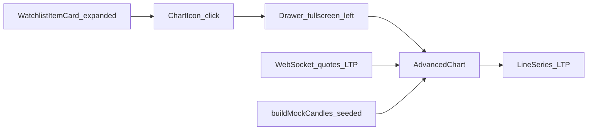

# Watchlist drawer chart: TradingView-like Line (LTP) now, Candle-ready later

## What we’ll change

- Update the Watchlist expanded-row **chart icon** flow so the left `Drawer` shows a **Line chart** (LTP-only) that **live-updates from WebSocket ticks**, and expose a **Line / Candles** selector where **Candles is disabled (“Coming soon”)**.
- Keep the chart component API **compatible with future candle data** (OHLC) so enabling candles later is mostly wiring + data feed.

## Key files to touch

- UI entrypoint: [`components/watchlist/WatchlistItemCard.tsx`](components/watchlist/WatchlistItemCard.tsx)
- Chart implementation: [`components/charts/AdvancedChart.tsx`](components/charts/AdvancedChart.tsx)
- Shared helpers (already exist): [`lib/charts/mock-candles.ts`](lib/charts/mock-candles.ts)
- Docs: [`docs/CHART_INTEGRATION_GUIDE.md`](docs/CHART_INTEGRATION_GUIDE.md)

## Implementation approach

### 1) Make `AdvancedChart` support “Line” now with candle-ready structure

- Add a small chart-type model:
  - `type ChartType = 'line' | 'candles'`
- Extend `AdvancedChart` props to accept:
  - `currentPrice?: number` (LTP)
  - `initialChartType?: ChartType` (default `'line'`)
  - Keep `mockSeries?: MockCandle[]` (still useful for deterministic history/backfill)
- Render a header control:
  - **Line** (active)
  - **Candles** (disabled + tooltip text “Coming soon”)
- Internally build **line series data** from existing candle-compatible data:
  - `candlesToLineSeries(chartCandles)` → `{ time, value }[]`
- Implement **live LTP updates**:
  - On `currentPrice` changes, `series.update({ time: nowSeconds, value: currentPrice })`
  - If `nowSeconds` equals the last point’s time, update the last point instead of appending.

### 2) Wire live LTP into `AdvancedChart` from the watchlist item

- In [`components/watchlist/WatchlistItemCard.tsx`](components/watchlist/WatchlistItemCard.tsx), pass `ltp` into the drawer chart:
  - `currentPrice={ltp}`
  - `initialChartType="line"`
- Keep passing `mockSeries={mockCandles}` so the chart has a deterministic back-history even before enough live ticks accumulate.

### 3) Preserve candle compatibility for later

- Keep the existing candlestick-series creation logic in `AdvancedChart`, but don’t allow enabling it from UI yet.
- Maintain a single candle-shaped source of truth (`MockCandle[]`) so when real OHLC arrives we can swap the source while leaving the chart wiring intact.

### 4) Update docs to match behavior

- Update [`docs/CHART_INTEGRATION_GUIDE.md`](docs/CHART_INTEGRATION_GUIDE.md) to reflect:
  - Watchlist drawer defaults to **Line (LTP)**
  - **Candles disabled** pending OHLC feed
  - Live-update behavior while drawer is open

## Flow (updated)

## Validation

- Open dashboard → watchlist → expand a ticker → tap the chart icon.
- Confirm:
  - Line chart renders immediately (using deterministic history)
  - As LTP changes, the line updates (no crashes, no “time going backwards” errors)
  - Candles control is visible but disabled with “Coming soon”.

## Implementation todos

- `advchart-charttype`: Add `ChartType` + line series support + disabled candle toggle in `AdvancedChart`.
- `advchart-live-ltp`: Implement safe `currentPrice` live-update logic (append/update-by-second).
- `watchlist-wire-ltp`: Pass `currentPrice={ltp}` and `initialChartType="line"` from `WatchlistItemCard`.
- `docs-update-chart`: Update `docs/CHART_INTEGRATION_GUIDE.md` watchlist flow section to match.