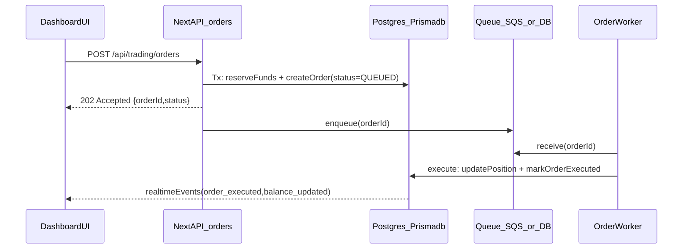

## What’s slow today (based on code)

- The `/dashboard` order sheet ultimately calls `POST /api/trading/orders` (`app/api/trading/orders/route.ts`). That endpoint **awaits** `OrderExecutionService.placeOrder()`.
- `OrderExecutionService.placeOrder()` does **multiple DB-heavy steps synchronously**, including:
  - Creating/repairing `Stock` records (`ensureStockForOrder`)
  - Margin checks
  - **Prisma transaction** around order creation
  - Inside that transaction it calls `FundManagementService.blockMargin()` and `.debit()`, which each start **their own Prisma `$transaction**` via `executeInTransaction()`.

This “transaction inside transaction” pattern is a classic reason for **lock waits + `maxWait` delays** (your wrapper allows up to 30s), which matches your observed 10–15s.

## Target behavior (as you selected)

- API should return **fast** once order is **ACCEPTED/QUEUED** (orderId + PENDING/QUEUED), and execution/position updates happen asynchronously.

## Implementation approach (works on EC2 Docker and Amplify)

### 1) Eliminate nested transactions (biggest backend latency win)

- Update `FundManagementService` (`lib/services/funds/FundManagementService.ts`) to support using an existing `Prisma.TransactionClient`:
  - Add `blockMarginTx(...)`, `debitTx(...)`, `releaseMarginTx(...)`, etc.
  - Keep existing public methods but make them delegate to Tx-aware implementations.
- In `OrderExecutionService.placeOrder()` (`lib/services/order/OrderExecutionService.ts`), use **one** `executeInTransaction()` and pass `tx` through to:
  - account margin/balance updates
  - transaction row creation
  - order row creation
  - (optional) minimal “accepted” audit rows

Also reduce redundant DB reads (account is fetched multiple times across services) by selecting only needed columns.

### 2) Return fast from the API (don’t await execution)

- Change `OrderExecutionService.placeOrder()` to:
  - Create/validate stock reference (or ensure it exists)
  - Reserve funds + create the order (status `PENDING` or `QUEUED`) in one transaction
  - Return immediately: `{ success: true, orderId, message: "Order accepted", executionScheduled: true }`
- Move synchronous `executeOrder(...)` + notifications out of the request path.

### 3) Add an async execution worker (portable)

Because Amplify/serverless cannot reliably run “background work after response”, use an externalized worker pattern.

- **Worker logic**: a new service like `lib/services/order/OrderExecutionWorker.ts` that:
  - Claims `PENDING/QUEUED` orders with a safe status transition (idempotent)
  - Executes them (update position, mark order executed, etc.)
  - Emits realtime updates automatically via existing Prisma middleware (`lib/prisma-middleware.ts`) when DB rows change
- **EC2 Docker path**: run the worker as a separate process/container.
- **Amplify fallback path**: run the worker as an AWS Lambda triggered by EventBridge schedule (poll DB) or by SQS (preferred).
  - The Next.js API enqueues orderId to SQS quickly; Lambda processes it.

### 4) Reduce DB reads in market-session checks

- `getSegmentTradingSession()` (`lib/server/market-timing.ts`) hits DB for holidays every call. Add an in-memory cache for the parsed holiday set (TTL e.g. 5–60 minutes) to reduce DB calls on each order.

### 5) Add precise timing instrumentation

- Add step timers (or nested `trackOperation(...)`) around:
  - `getSegmentTradingSession`
  - `ensureStockForOrder`
  - margin calc
  - fund reservation
  - order create
  This will confirm we removed the 10–15s tail and guard against regressions.

## Deployment recommendation (your question)

- **Best for trading + realtime + low latency**: Docker on **EC2/ECS** (or EKS) because you control long-lived processes (WebSockets, worker, warm connections) and avoid serverless cold starts.
- **Amplify as fallback**: keep the order execution **worker external** (SQS + Lambda, or scheduled Lambda) so the Next.js app can run in Amplify without relying on in-process background jobs.

## Data flow (target)

