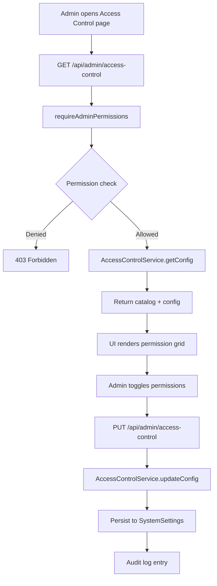
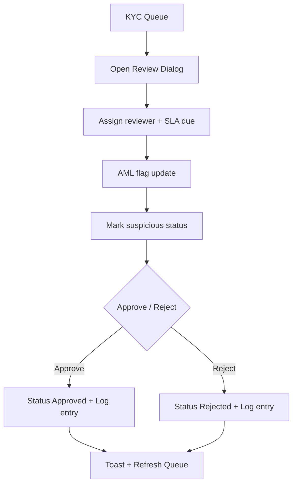
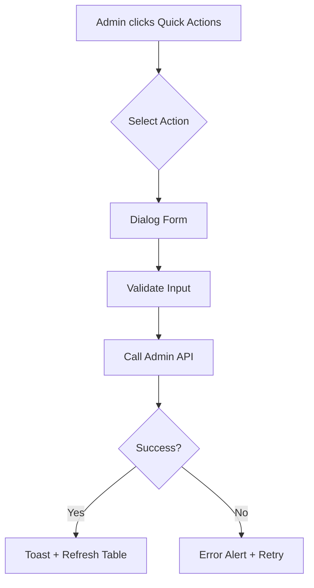

# Module: admin-console

**Short:** Admin console UI with access control management and operational workflows.

**Purpose:** Provide administrators a secure dashboard for operations, including RBAC management, user management, fund approvals, and risk monitoring. Focuses on fast operator workflows with robust error visibility.

## Key Screens
- **Dashboard:** Platform KPIs, alerts, and top traders.
- **User Management:** Search, filters, bulk actions, and per-user dialogs.
- **Fund Management:** Deposits and withdrawals review with approvals.
- **Risk Management:** Platform risk config, user limits, alerts, and the unified risk backstop (positions worker is canonical enforcer).
- **Access Control:** RBAC management UI.
- **KYC Queue:** Dedicated queue for KYC verification with SLA tracking.
- **Workers:** Background worker visibility (status/heartbeat), Redis realtime readiness, enable/disable, and run-once triggers (including risk backstop skip reasons).
- **System Health, Logs, Settings, Notifications, Financial Reports.**

## User Quick Actions
Exposes existing admin APIs in the User Management table:
- Reset password: `POST /api/admin/users/{userId}/reset-password`
- Reset MPIN: `POST /api/admin/users/{userId}/reset-mpin`
- Freeze/unfreeze account: `POST /api/admin/users/{userId}/freeze`
- Verify contact (email/phone): `POST /api/admin/users/{userId}/verify-contact`
- Assign/unassign RM: `PATCH /api/admin/users/{userId}/assign-rm`
- Risk limits override: `GET/PUT /api/admin/users/{userId}/risk-limit`

## Data Source Clarity
- Live/Partial/Error/Sample statuses surfaced on Dashboard, User Management, and Fund Management.
- Sample data is manual-only and never auto-selected.
- Error alerts include reasons for each failing endpoint.

## KYC & Compliance Ops
- Dedicated queue: `GET /api/admin/kyc` → `/admin-console/kyc`
- Assignment & SLA tracking: `PATCH /api/admin/kyc`
- AML flags + suspicious review status (clear/review/escalated)
- Review logs stored in `kyc_review_logs`
- Document viewer for bank proof URL
- Filters include AML flag match and SLA buckets (24h/48h/72h)

## Files
- `header.tsx` — loads admin session, role, and permissions
- `sidebar.tsx` — navigation gated by permissions
- `access-control.tsx` — RBAC management UI
- `risk-management.tsx` — risk limits/config + alerts + thresholds + run-now backstop
- `workers.tsx` — worker cards (health, enable/disable, run once, config inputs)
- `kyc-queue.tsx` — KYC queue with assignment and AML controls
- `app/(admin)/admin-console/kyc/page.tsx` — KYC queue entry
- `app/(admin)/admin-console/access-control/page.tsx` — access control page entry
- `app/(admin)/admin-console/workers/page.tsx` — workers page entry
- `app/api/admin/access-control/route.ts` — RBAC config API
- `app/api/admin/kyc/route.ts` — KYC queue + review actions API
- `app/api/admin/kyc/[kycId]/route.ts` — KYC detail + review logs API
- `app/api/admin/workers/route.ts` — worker status + manage API (no CRON secrets in browser)
- `app/api/admin/risk/thresholds/route.ts` — read/update canonical risk thresholds (SystemSettings)
- `app/api/admin/risk/monitor/route.ts` — run risk backstop (skips if positions worker healthy unless force-run)
- `lib/server/workers/registry.ts` — worker registry + health rules + SystemSettings keys
- `lib/admin/kyc-utils.ts` — SLA and AML flag utilities
- `lib/services/admin/AccessControlService.ts` — RBAC config persistence
- `MODULE_DOC.md` — this file

## Flow Diagrams

### RBAC Management

### KYC Review Flow

### Quick Action Flow

## Dependencies
- `lib/rbac` for permission catalog and guard
- `lib/services/admin/AccessControlService`
- `@/auth` for session resolution
- `AdminSessionProvider` for reactive role/permission state across admin console UI

## APIs
- `GET /api/admin/access-control` — fetch role permissions and catalog
- `PUT /api/admin/access-control` — update role permissions
- `GET /api/admin/kyc` — list KYC queue with filters
- `PATCH /api/admin/kyc` — update assignment/SLA/AML/suspicious
- `PUT /api/admin/kyc` — approve/reject KYC
- `GET /api/admin/kyc/{kycId}` — fetch KYC detail + logs
- `GET /api/admin/me` — session user + permissions for UI gating
- `GET/PUT /api/admin/users/{userId}/statement-override` — per-user statements tri-state override (default/force_enable/force_disable)
- `GET /api/admin/workers` — list workers with enabled + heartbeat health
- `POST /api/admin/workers` — toggle enabled, run once, set PnL mode
- `GET/PUT /api/admin/risk/thresholds` — read/update canonical thresholds in SystemSettings
- `GET/POST /api/admin/risk/monitor` — risk backstop endpoint (positions worker is canonical enforcer)

## Env vars
None.

## Tests
`tests/admin/access-control-guard.test.ts`

## Changelog
- 2026-01-15 (IST): Added user quick actions for admin APIs and data source status messaging on core admin pages.
- 2026-01-15 (IST): Added KYC queue with assignment, SLA tracking, AML flags, and review logs.
- 2026-01-15 (IST): Added AML flag filter and extended SLA buckets in KYC queue.
- 2026-01-15 (IST): Added RBAC access-control UI, restricted permission gating, and audit logging.
- 2026-01-25 (IST): Hardened Access Control reliability via `AdminSessionProvider` (reactive permissions), improved `/api/admin/me` error handling/logging, and added RBAC audit diffs.
- 2026-01-25 (IST): Added professional mini scrollbar to admin console sidebar.
- 2026-02-03 (IST): Added app-wide statements toggle in Settings + per-user statements override (tri-state) in Edit User dialog; statement exports blocked when disabled.
- 2026-02-04 (IST): Added Workers page to manage background workers (heartbeats, enable/disable toggles, and run-once triggers) via `/api/admin/workers`.
- 2026-02-13 (IST): Enhanced Workers page to show Redis realtime bus state + detailed heartbeat stats (scanned/updated/errors/elapsed) for faster ops debugging of worker→dashboard updates.
- 2026-02-13 (IST): Updated Risk Management tab to edit canonical risk thresholds (SystemSettings) and run unified risk backstop (skips when positions worker is healthy unless force-run).
