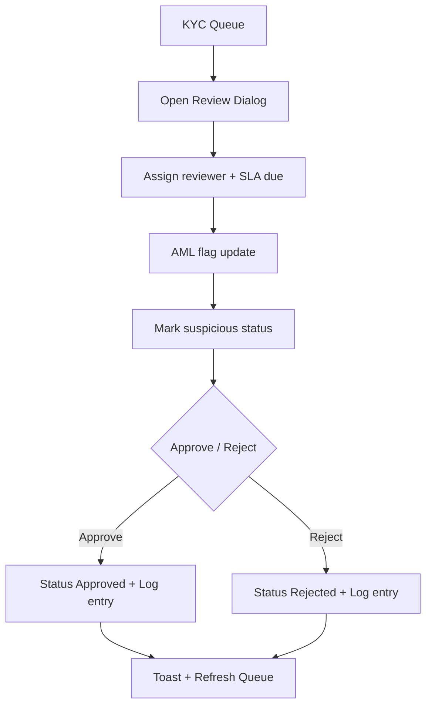
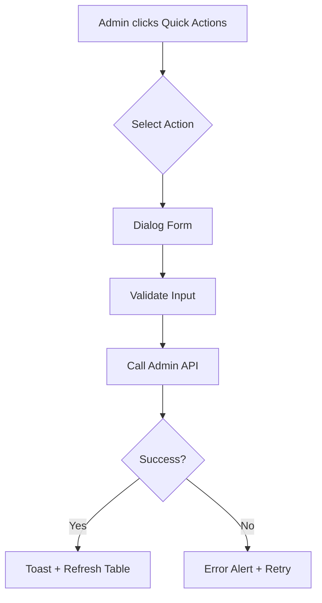
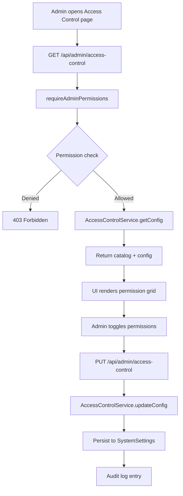

# Admin Console Module Doc

## Purpose
Provide administrative control surfaces for users, funds, risk, and system operations in the TradePro platform. This module focuses on fast operator workflows with robust error visibility and explicit data source status.

## Key Screens
- Dashboard: platform KPIs, alerts, and top traders.
- User Management: search, filters, bulk actions, and per-user dialogs.
- Fund Management: deposits and withdrawals review with approvals.
- Risk Management: platform risk config, user limits, and monitoring.
- System Health, Logs, Settings, Notifications, Financial Reports.

## User Quick Actions
Exposes existing admin APIs in the User Management table:
- Reset password: `POST /api/admin/users/{userId}/reset-password`
- Reset MPIN: `POST /api/admin/users/{userId}/reset-mpin`
- Freeze/unfreeze account: `POST /api/admin/users/{userId}/freeze`
- Verify contact (email/phone): `POST /api/admin/users/{userId}/verify-contact`
- Assign/unassign RM: `PATCH /api/admin/users/{userId}/assign-rm`
- Risk limits override: `GET/PUT /api/admin/users/{userId}/risk-limit`

## Data Source Clarity
- Live/Partial/Error/Sample statuses surfaced on Dashboard, User Management, and Fund Management.
- Sample data is manual-only and never auto-selected.
- Error alerts include reasons for each failing endpoint.

## KYC & Compliance Ops
- Dedicated queue: `GET /api/admin/kyc` → `/admin-console/kyc`
- Assignment & SLA tracking: `PATCH /api/admin/kyc`
- AML flags + suspicious review status (clear/review/escalated)
- Review logs stored in `kyc_review_logs`
- Document viewer for bank proof URL
- Filters include AML flag match and SLA buckets (24h/48h/72h)

## KYC Review Flow (Mermaid)

## Quick Action Flow (Mermaid)

## Changelog
- 2026-01-15 (IST): Added user quick actions for admin APIs and data source status messaging on core admin pages.
- 2026-01-15 (IST): Added KYC queue with assignment, SLA tracking, AML flags, and review logs.
- 2026-01-15 (IST): Added AML flag filter and extended SLA buckets in KYC queue.
# Module: admin-console

**Short:** Admin console UI with access control management.

**Purpose:** Provide administrators a secure dashboard for operations, including RBAC management.

**Files:**
- `header.tsx` — loads admin session, role, and permissions
- `sidebar.tsx` — navigation gated by permissions
- `access-control.tsx` — RBAC management UI
- `kyc-queue.tsx` — KYC queue with assignment and AML controls
- `app/(admin)/admin-console/kyc/page.tsx` — KYC queue entry
- `app/(admin)/admin-console/access-control/page.tsx` — access control page entry
- `app/api/admin/access-control/route.ts` — RBAC config API
- `app/api/admin/kyc/route.ts` — KYC queue + review actions API
- `app/api/admin/kyc/[kycId]/route.ts` — KYC detail + review logs API
- `lib/admin/kyc-utils.ts` — SLA and AML flag utilities
- `lib/services/admin/AccessControlService.ts` — RBAC config persistence
- `MODULE_DOC.md` — this file

**Flow diagram (RBAC management):**

**Dependencies:**
- `lib/rbac` for permission catalog and guard
- `lib/services/admin/AccessControlService`
- `@/auth` for session resolution

**APIs:**
- `GET /api/admin/access-control` — fetch role permissions and catalog
- `PUT /api/admin/access-control` — update role permissions
- `GET /api/admin/kyc` — list KYC queue with filters
- `PATCH /api/admin/kyc` — update assignment/SLA/AML/suspicious
- `PUT /api/admin/kyc` — approve/reject KYC
- `GET /api/admin/kyc/{kycId}` — fetch KYC detail + logs
- `GET /api/admin/me` — session user + permissions for UI gating

**Env vars:** none.

**Tests:** `tests/admin/access-control-guard.test.ts`

**Change-log:**
- 2026-01-15: Added RBAC access-control UI, restricted permission gating, and audit logging.
