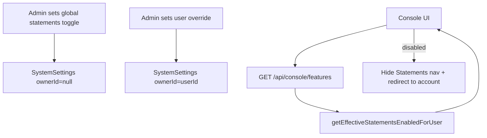

<!--
File: components/console/MODULE_DOC.md
Module: console
Purpose: Document the Trading Console UI module (navigation, sections, feature gating).
Author: Cursor / BharatERP
Last-updated: 2026-02-03
Notes:
- This module is UI-focused and lives under Next.js `components/console/`.
-->

# Module: console

**Short:** End-user Trading Console (profile, account, statements, deposits, withdrawals, banks, security).

**Purpose:** Provide users a dedicated console for account operations and history. Includes feature gating for compliance/ops controls.

## Key Screens / Routes
- `app/(console)/console/page.tsx` — main console page and section router

## Sections
- `ProfileSection` — profile editing
- `AccountSection` — balance / account summary
- `StatementsSection` — transactions history (feature gated)
- `DepositsSection` — add funds
- `WithdrawalsSection` — withdraw funds
- `BankAccountsSection` — bank management
- `SecuritySection` — security settings

## Feature gating: Statements

### Behavior
When statements are disabled, the console hides the **Statements** navigation item and prevents rendering the `StatementsSection`.

### Sources (effective resolution)
- Per-user override (tri-state): `SystemSettings(ownerId=<userId>, key=console_statements_enabled_override)`
  - `force_enable` / `force_disable`
- Global toggle: `SystemSettings(ownerId=null, key=console_statements_enabled_global)` (defaults to enabled if missing)

### Flow

## Files
- `components/console/console-layout.tsx` — layout + sidebar integration
- `components/console/sidebar-menu.tsx` — navigation menu (filters Statements when disabled)
- `components/console/sections/statements-section.tsx` — statements UI
- `lib/hooks/use-console-features.ts` — fetch feature availability
- `app/api/console/features/route.ts` — features endpoint
- `lib/server/console-statements.ts` — global + per-user resolution helper

## Changelog
- 2026-02-03 (IST): Added app-wide + per-user tri-state gating for statements; console hides Statements nav and blocks statement export when disabled.

