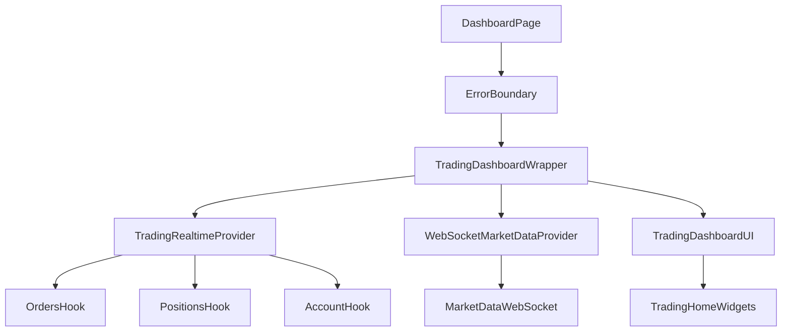

## Overview

The `/dashboard` trading experience is built around **two realtime channels**:

- **Trading data (orders/positions/account)**: SSE + REST polling fallback (SWR) for correctness.
- **Market data (quotes/LTP)**: WebSocket (Socket.IO) streaming for low-latency UI updates.

The UI is designed to remain usable during partial outages (e.g., market-data offline while account/orders still load).

## Key Components

- `components/trading/TradingDashboard.tsx`
  - Tabs, header, navigation, dialog wiring.
  - Reads realtime trading data from `TradingRealtimeProvider`.
  - Reads quotes/connection status from `WebSocketMarketDataProvider`.
- `components/trading/realtime/trading-realtime-provider.tsx`
  - Single source of truth for orders/positions/account via:
    - `lib/hooks/use-realtime-orders.ts`
    - `lib/hooks/use-realtime-positions.ts`
    - `lib/hooks/use-realtime-account.ts`
- `lib/market-data/providers/WebSocketMarketDataProvider.tsx`
  - Market quote stream + token subscription management.
  - On `/dashboard`, uses `TradingRealtimeProvider`’s position tokens to avoid duplicate position fetching.

## Realtime Strategy

### Trading (orders/positions/account)

- SSE stream: `lib/hooks/use-shared-sse.ts` (single EventSource per userId).
- Fallback polling: each realtime hook runs **visibility-aware polling with exponential backoff + jitter**.
  - When tab is hidden: polling slows dramatically.
  - When tab becomes visible: immediate refresh is triggered.

### Market data (quotes)

- WebSocket stream owned by `WebSocketMarketDataProvider`.
- Subscriptions are derived from:
  - index tokens
  - watchlist tokens
  - position tokens (from TradingRealtimeProvider on dashboard)

## Flowchart (High-Level)

## UX/Resilience Behavior

- **Auth missing**: `/dashboard` redirects to `/auth/login?callbackUrl=/dashboard`.
- **Market data offline**: non-blocking banner; UI uses last-known quotes.
- **Trading data partial failure**: non-blocking warning banner if some cached data exists.
- **Trading data total failure**: full-screen error with retry.

## Logging & Telemetry

- **Client/UI**: `lib/logging/client-logger.ts`
  - Namespaced console logging with debug gating + throttling.
- **API telemetry**: `lib/observability/api-telemetry.ts`
  - Standardized start/success/error logs via pino (`lib/observability/logger.ts`).
- **Audit logs**:
  - Prisma DB: `lib/services/logging/TradingLogger.ts`
  - Supabase server logs: `lib/server/logger.ts`

## Feature Flags

- `NEXT_PUBLIC_ENABLE_WS_MARKET_DATA`: enable/disable market data websocket streaming.
- `NEXT_PUBLIC_DEBUG_REALTIME`: enable verbose realtime debug logs.
- `NEXT_PUBLIC_DEBUG_MARKETDATA`: enable verbose market-data provider logs.
- `NEXT_PUBLIC_DEBUG`: enable general client debug logs.

