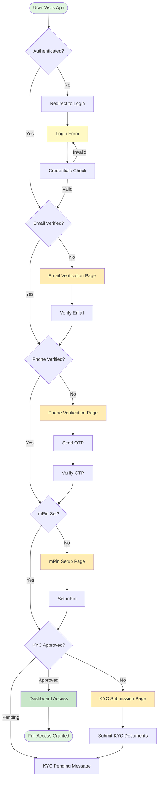
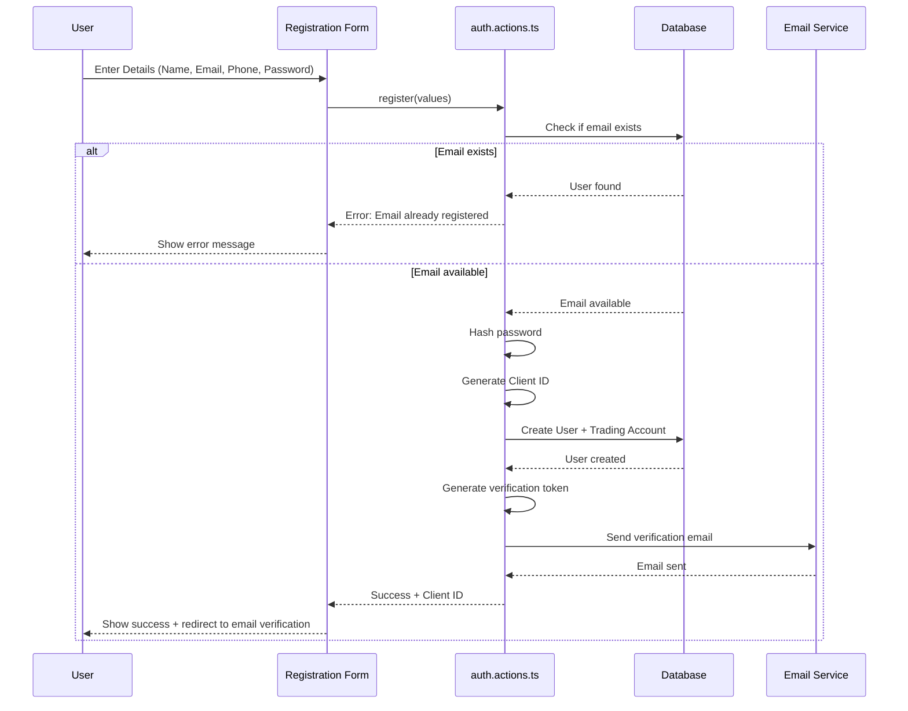
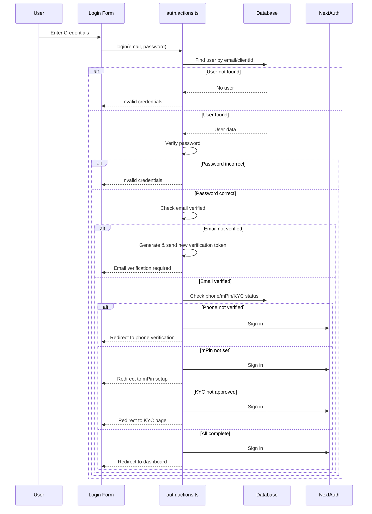
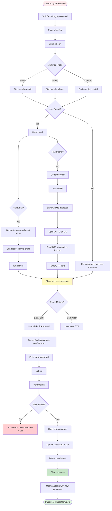
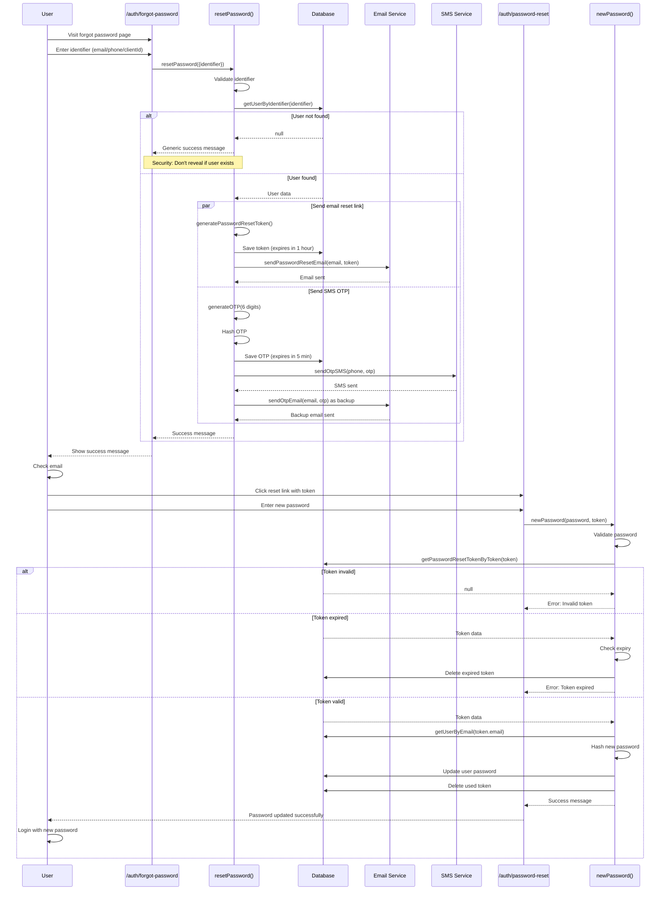
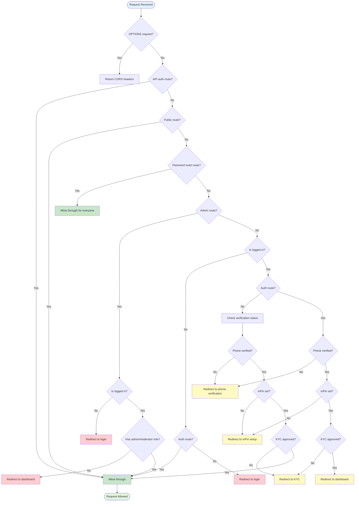

# Authentication Module - Complete Guide

> **Last Updated:** 2025-10-07  
> **Status:** ✅ Fully Implemented and Tested

---

## 📚 Table of Contents

1. [Overview](#overview)
2. [Architecture](#architecture)
3. [Authentication Flow](#authentication-flow)
4. [Password Reset Flow](#password-reset-flow)
5. [Middleware Rules](#middleware-rules)
6. [API Reference](#api-reference)
7. [Security Features](#security-features)
8. [Troubleshooting](#troubleshooting)

---

## 🎯 Overview

The authentication module provides a comprehensive, secure authentication system with multi-factor verification, password reset capabilities, and progressive profile completion.

### Key Features

- ✅ Email/Password authentication
- ✅ Mobile/Client ID authentication
- ✅ Email verification
- ✅ Phone/SMS verification
- ✅ mPin security layer
- ✅ KYC verification
- ✅ Password reset (Email + SMS OTP)
- ✅ Session management
- ✅ Role-based access control (RBAC)

---

## 🏗️ Architecture

### Tech Stack

- **Framework:** Next.js 14 with App Router
- **Authentication:** NextAuth.js v5 (Auth.js)
- **Database:** PostgreSQL with Prisma ORM
- **Email:** Resend API
- **SMS:** AWS SNS
- **Session:** JWT-based sessions

### File Structure

```
/workspace
├── app/
│   ├── (main)/auth/
│   │   ├── login/page.tsx                  # Login page
│   │   ├── register/page.tsx               # Registration page
│   │   ├── forgot-password/page.tsx        # Password reset request
│   │   ├── password-reset/page.tsx         # New password entry
│   │   ├── email-verification/page.tsx     # Email verification
│   │   ├── phone-verification/page.tsx     # Phone verification
│   │   ├── mpin-setup/page.tsx            # mPin setup
│   │   ├── mpin-verify/page.tsx           # mPin verification
│   │   └── kyc/page.tsx                   # KYC submission
│   └── api/auth/
│       └── [...nextauth]/route.ts          # NextAuth API routes
├── actions/
│   ├── auth.actions.ts                     # Server actions (login, register, etc.)
│   └── mobile-auth.actions.ts              # Mobile-specific auth actions
├── components/auth/
│   ├── loginform.tsx                       # Login form component
│   ├── SignUpForm.tsx                      # Registration form
│   ├── MobileLoginForm.tsx                 # Mobile login form
│   ├── MobileRegistrationForm.tsx          # Mobile registration
│   ├── OtpVerificationForm.tsx             # OTP verification UI
│   └── ... (other auth components)
├── middleware.ts                           # Route protection middleware
├── auth.ts                                 # NextAuth configuration
├── data/
│   ├── user.ts                            # User data access layer
│   ├── verification-token.ts              # Email tokens
│   └── password-reset-token.ts            # Password reset tokens
├── lib/
│   ├── tokens.ts                          # Token generation utilities
│   ├── ResendMail.ts                      # Email service
│   ├── aws-sns.ts                         # SMS service
│   └── otp-service.ts                     # OTP utilities
└── schemas/
    └── index.ts                            # Zod validation schemas
```

---

## 🔐 Authentication Flow

### Complete User Journey



### Registration Flow



### Login Flow



---

## 🔑 Password Reset Flow

### High-Level Flow



### Detailed Sequence



### Password Reset Routes

| Route | Access | Purpose |
|-------|--------|---------|
| `/auth/forgot-password` | **Everyone** (logged in or not) | Request password reset |
| `/auth/password-reset?token=...` | **Everyone** (logged in or not) | Set new password |

**⚠️ CRITICAL:** These routes MUST be accessible to all users, including logged-in users, as they may need to reset their password even when authenticated.

---

## 🛡️ Middleware Rules

### Route Classification

```typescript
// Public routes (no auth required)
const publicRoutes = [
  "/auth/error",
  "/api/graphql",
  "/api/quotes",
  "/api/otp",
  "/api/mpin",
  "/api/health",
  "/api/auth/*"
];

// Auth routes (redirect logged-in users to dashboard)
const authRoutes = [
  "/auth/login",
  "/auth/register",
  "/auth/forgot-password",    // BUT: See exception below!
  "/auth/password-reset",      // BUT: See exception below!
  "/auth/email-verification",
  "/auth/otp-verification",
  "/auth/mpin-setup",
  "/auth/mpin-verify",
  "/auth/phone-verification",
  "/auth/kyc"
];

// Password reset routes (accessible to EVERYONE)
const passwordResetRoutes = [
  "/auth/forgot-password",
  "/auth/password-reset"
];
```

### Middleware Logic Flow



### Key Middleware Features

1. **Password Reset Exception**
   ```typescript
   // Section 2.25 - Allows password reset for everyone
   if (isPasswordResetRoute) {
     console.log(`[MIDDLEWARE] 🔓 Password reset route - allowing access for all users`);
     return NextResponse.next();
   }
   ```

2. **Progressive Verification Gating**
   - Phone verification → mPin setup → KYC approval
   - Each gate redirects to next incomplete step

3. **Admin Access Control**
   - Requires `ADMIN` or `MODERATOR` role
   - Redirects unauthorized users to dashboard

4. **Comprehensive Logging**
   - Every middleware decision is logged with emoji prefixes
   - Easy debugging and monitoring

---

## 📡 API Reference

### Server Actions

#### `login(values)`
Authenticates user with email/password.

**Parameters:**
```typescript
{
  email: string;      // Email or Client ID
  password: string;
}
```

**Returns:**
```typescript
{
  success?: string;
  error?: string;
  redirectTo?: string;
  requiresEmailVerification?: boolean;
  requiresPhoneVerification?: boolean;
  requiresMpinSetup?: boolean;
  requiresKyc?: boolean;
}
```

#### `register(values)`
Creates new user account.

**Parameters:**
```typescript
{
  name: string;
  email: string;
  phone?: string;
  password: string;
}
```

**Returns:**
```typescript
{
  success?: string;
  error?: string;
  clientId?: string;
}
```

#### `resetPassword(values)`
Initiates password reset process.

**Parameters:**
```typescript
{
  identifier: string;  // Email, phone, or Client ID
}
```

**Returns:**
```typescript
{
  success?: string;
  error?: string;
}
```

**Process:**
1. Finds user by identifier (email/phone/clientId)
2. Generates password reset token (1 hour expiry)
3. Sends reset link via email
4. Generates OTP (5 minute expiry)
5. Sends OTP via SMS
6. Sends OTP via email as backup

#### `newPassword(values, token)`
Sets new password using reset token.

**Parameters:**
```typescript
{
  password: string;  // New password (8-32 chars)
}
token: string;       // Reset token from URL
```

**Returns:**
```typescript
{
  success?: string;
  error?: string;
}
```

**Process:**
1. Validates token exists and not expired
2. Hashes new password
3. Updates user password in database
4. Deletes used token
5. Returns success message

---

## 🔒 Security Features

### Password Hashing
- **Algorithm:** bcrypt with 10 salt rounds
- **Strength:** Industry-standard password hashing

### Token Security

#### Email Verification Token
- **Format:** UUID v4
- **Expiry:** Configurable (typically 24 hours)
- **Storage:** PostgreSQL with indexed lookup
- **Single-use:** Deleted after successful verification

#### Password Reset Token
- **Format:** UUID v4
- **Expiry:** 1 hour
- **Storage:** PostgreSQL with user association
- **Single-use:** Deleted after password update
- **Validation:** Checked for expiry before use

#### OTP (One-Time Password)
- **Format:** 6-digit numeric
- **Expiry:** 5 minutes
- **Storage:** Hashed in database
- **Rate limiting:** Attempt counter
- **Purpose-specific:** Different OTPs for different purposes

### User Enumeration Prevention
- Generic success messages for password reset
- Same response whether user exists or not
- Prevents account discovery attacks

### Session Management
- **Strategy:** JWT-based sessions
- **Storage:** HTTP-only cookies
- **Refresh:** Automatic with NextAuth.js
- **Logout:** Complete session destruction

### Multi-Factor Authentication
1. **Email verification** (First factor)
2. **Phone/SMS verification** (Second factor)
3. **mPin** (Additional security layer)
4. **KYC verification** (Identity verification)

---

## 🐛 Troubleshooting

### Common Issues

#### Issue: Can't access forgot password page when logged in
**Solution:** ✅ Fixed! Password reset routes now accessible to everyone.

```typescript
// middleware.ts - Section 2.25
if (isPasswordResetRoute) {
  return NextResponse.next(); // Allow for all users
}
```

#### Issue: Password reset email not received
**Checklist:**
1. Check console logs for `[AUTH] ✅ Password reset email sent`
2. Verify email service configuration in `.env`
3. Check spam/junk folder
4. Verify user has email address in database
5. Check Resend API dashboard for delivery status

**Debug:**
```bash
# Check auth action logs
grep "\[AUTH\]" logs/*.log

# Verify email service
grep "Email service" logs/*.log
```

#### Issue: SMS OTP not received
**Checklist:**
1. Check console logs for `[AUTH] ✅ Password reset OTP sent`
2. Verify AWS SNS configuration
3. Check phone number format (+country code)
4. Verify phone number is verified in AWS SNS
5. Check AWS CloudWatch logs

**Debug:**
```bash
# Check SMS logs
grep "SMS" logs/*.log

# Check OTP generation
grep "OTP generated" logs/*.log
```

#### Issue: Token expired error
**Causes:**
- Password reset token valid for 1 hour
- OTP valid for 5 minutes
- User took too long to complete reset

**Solution:**
Request new password reset from `/auth/forgot-password`

#### Issue: Middleware redirect loop
**Causes:**
- Incorrect route classification
- Missing exception for password reset routes
- Session data not loading properly

**Debug:**
Check middleware logs:
```bash
grep "\[MIDDLEWARE\]" logs/*.log
```

Look for redirect patterns and route flags.

### Debug Mode

Enable verbose logging by checking console output:

1. **Frontend logs:** Browser console
2. **Backend logs:** Terminal running Next.js dev server
3. **Middleware logs:** Look for `[MIDDLEWARE]` prefix
4. **Auth action logs:** Look for `[AUTH]` prefix

### Testing Password Reset Flow

#### As Logged-Out User
```bash
# 1. Visit forgot password page
curl http://localhost:3000/auth/forgot-password

# 2. Submit identifier
# 3. Check email/SMS
# 4. Visit reset link
# 5. Enter new password
# 6. Login with new password
```

#### As Logged-In User
```bash
# 1. Login first
# 2. Visit forgot password page (should work!)
curl http://localhost:3000/auth/forgot-password

# 3. Complete reset flow
# 4. Logout and login with new password
```

---

## 📝 Summary

### What Works
✅ Complete authentication flow  
✅ Email verification  
✅ Phone/SMS verification  
✅ mPin security  
✅ KYC submission  
✅ Password reset (Email + SMS)  
✅ Password reset accessible to all users  
✅ Comprehensive error handling  
✅ Extensive debugging logs  
✅ Security best practices  

### Recent Fixes (2025-10-07)
✅ Fixed middleware to allow password reset routes for everyone  
✅ Added comprehensive console logging throughout auth module  
✅ Enhanced error handling with detailed stack traces  
✅ Documented complete auth flow with visual diagrams  

### Next Steps
- Run comprehensive test suite
- Monitor production logs for issues
- Update rate limiting for OTP requests
- Add email delivery status webhooks
- Implement password strength meter

---

**For more information, see:**
- [AUTH_PASSWORD_RESET.md](./AUTH_PASSWORD_RESET.md) - Password reset details
- [AUTH_QUICK_REFERENCE.md](../AUTH_QUICK_REFERENCE.md) - Quick reference guide
- [MPIN_RESET_FLOW.md](./MPIN_RESET_FLOW.md) - mPin reset process

---

**Last Updated:** 2025-10-07  
**Maintained By:** Development Team  
**Status:** ✅ Production Ready
