# Console Flow Diagrams

## Table of Contents

1. [User Authentication Flow](#user-authentication-flow)
2. [Console Data Loading Flow](#console-data-loading-flow)
3. [Bank Account Management Flow](#bank-account-management-flow)
4. [Deposit Request Flow](#deposit-request-flow)
5. [Withdrawal Request Flow](#withdrawal-request-flow)
6. [Profile Update Flow](#profile-update-flow)
7. [Transaction Atomic Flow](#transaction-atomic-flow)
8. [Mobile Navigation Flow](#mobile-navigation-flow)
9. [Error Handling Flow](#error-handling-flow)
10. [Real-time Data Refresh Flow](#real-time-data-refresh-flow)

---

## 1. User Authentication Flow

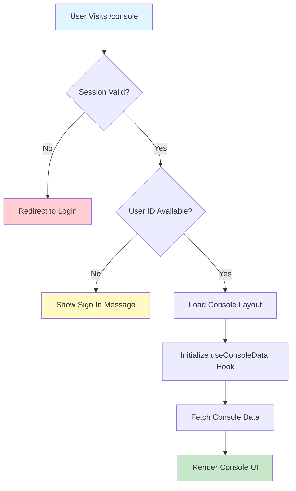

**Detailed Steps:**

1. **User Navigation**
   - User navigates to `/console`
   - Console page component loads
   - Log: `📥 [CONSOLE-PAGE] Page loaded`

2. **Session Validation**
   - NextAuth checks session cookie
   - Validates session expiry
   - Log: `🔐 [AUTH] Session check: { status, userId }`

3. **User ID Extraction**
   - Extract userId from session
   - Verify user is active
   - Log: `👤 [CONSOLE-PAGE] User ID: ${userId}`

4. **Console Initialization**
   - Mount ConsoleLayout
   - Initialize hooks
   - Load initial data
   - Log: `🎨 [CONSOLE-LAYOUT] Initializing...`

---

## 2. Console Data Loading Flow

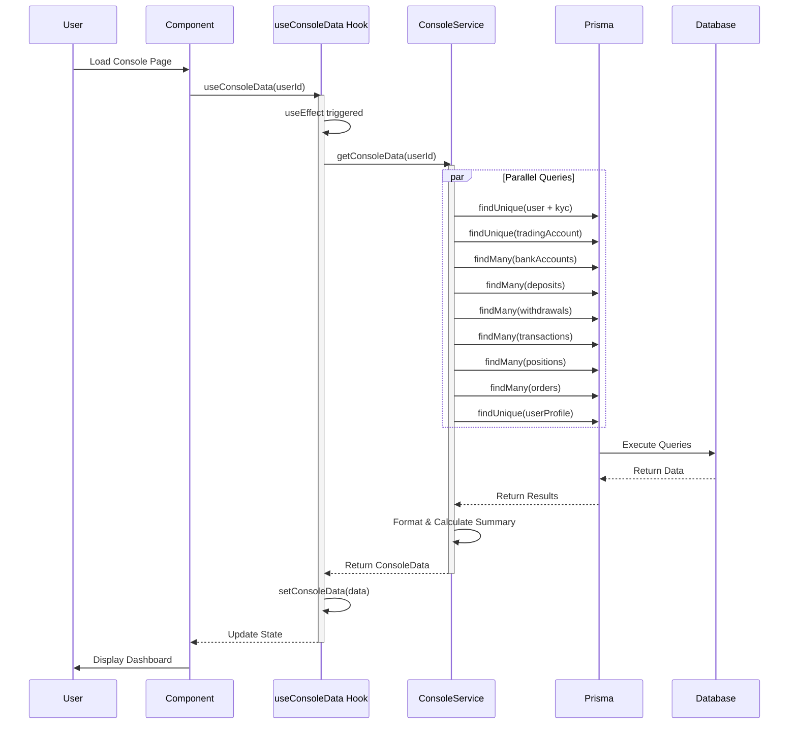

**Key Performance Optimizations:**

- ✅ All queries run in parallel using `Promise.all`
- ✅ Data limits prevent excessive loading
- ✅ Only active positions loaded
- ✅ Summary calculated server-side

**Logging Flow:**

```
📊 [CONSOLE-SERVICE] Fetching console data for user: abc123
✅ [CONSOLE-SERVICE] Data fetched successfully {
  userFound: true,
  bankAccountsCount: 2,
  depositsCount: 15,
  withdrawalsCount: 8,
  transactionsCount: 45,
  positionsCount: 3,
  ordersCount: 12
}
📈 [CONSOLE-SERVICE] Summary calculated: {
  totalDeposits: 150000,
  totalWithdrawals: 50000,
  pendingDeposits: 1,
  pendingWithdrawals: 0
}
✅ [CONSOLE-SERVICE] Console data prepared successfully
```

---

## 3. Bank Account Management Flow

### Add Bank Account Flow

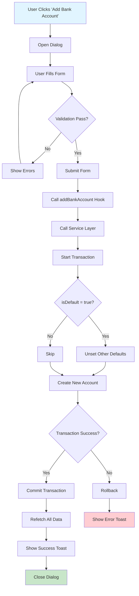

**Transaction Details:**

```typescript
// Atomic Transaction
executeInTransaction(async (tx) => {
  console.log('🔄 [CONSOLE-SERVICE] Starting add bank account transaction')
  
  // Step 1: Unset other defaults if needed
  if (bankData.isDefault) {
    console.log('🔄 [CONSOLE-SERVICE] Unsetting other default accounts')
    await tx.bankAccount.updateMany({
      where: { userId, isDefault: true },
      data: { isDefault: false }
    })
  }
  
  // Step 2: Create new account
  console.log('🔄 [CONSOLE-SERVICE] Creating new bank account')
  const account = await tx.bankAccount.create({
    data: { userId, ...bankData }
  })
  
  console.log('✅ [CONSOLE-SERVICE] Bank account created:', account.id)
  return account.id
})
```

### Update Bank Account Flow

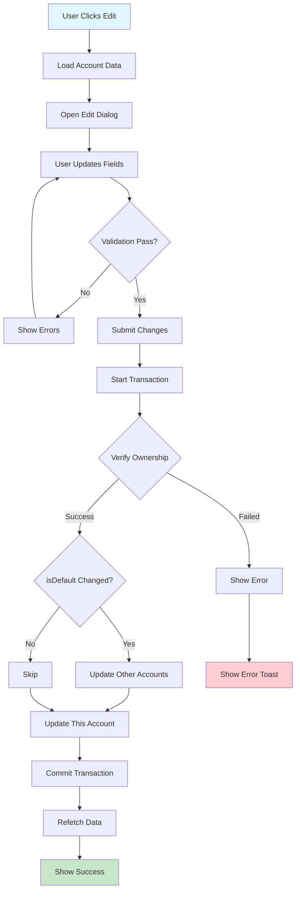

### Delete Bank Account Flow

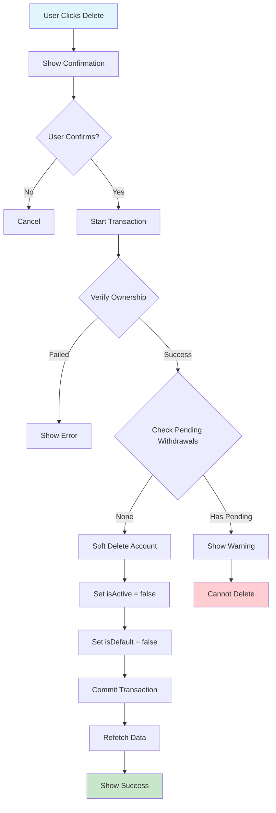

**Soft Delete Logic:**

```typescript
// Check for pending withdrawals
const pendingWithdrawals = await tx.withdrawal.count({
  where: {
    bankAccountId: accountId,
    status: { in: [WithdrawalStatus.PENDING, WithdrawalStatus.PROCESSING] }
  }
})

if (pendingWithdrawals > 0) {
  throw new Error('Cannot delete bank account with pending withdrawals')
}

// Soft delete
await tx.bankAccount.update({
  where: { id: accountId },
  data: { 
    isActive: false,
    isDefault: false,
    updatedAt: new Date()
  }
})
```

---

## 4. Deposit Request Flow

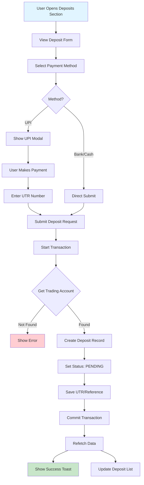

**UPI Payment Sub-Flow:**

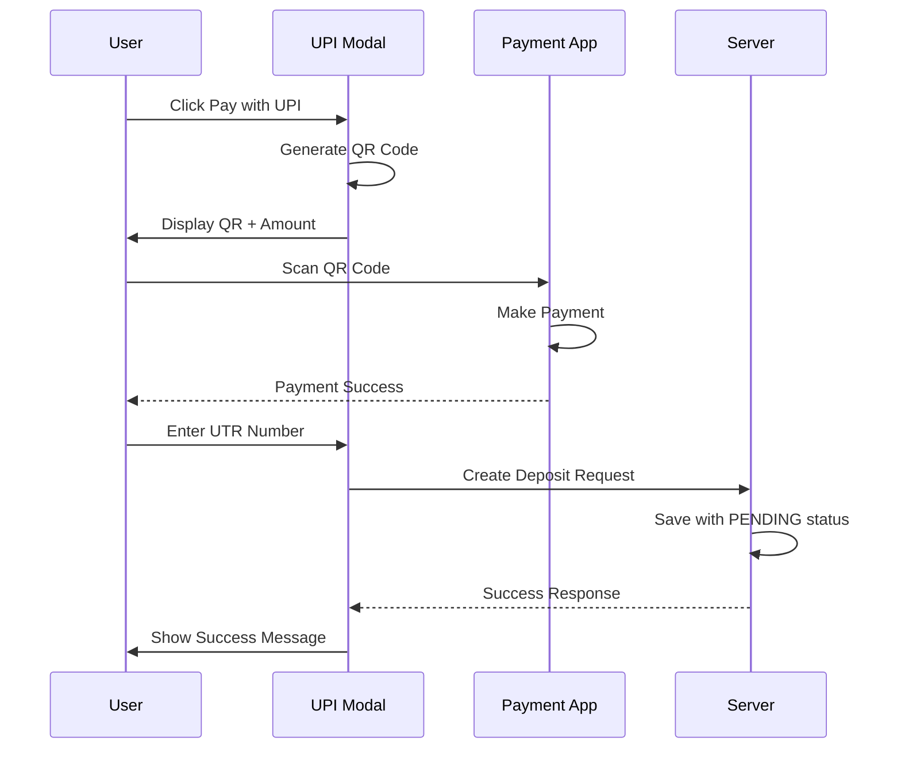

**Logging Flow:**

```
💰 [CONSOLE-SERVICE] Creating deposit request: { userId, amount: 10000, method: 'upi' }
🔄 [CONSOLE-SERVICE] Starting create deposit transaction
🔄 [CONSOLE-SERVICE] Creating deposit record
✅ [CONSOLE-SERVICE] Deposit record created: dep_abc123
✅ [CONSOLE-SERVICE] Deposit request created successfully
```

---

## 5. Withdrawal Request Flow

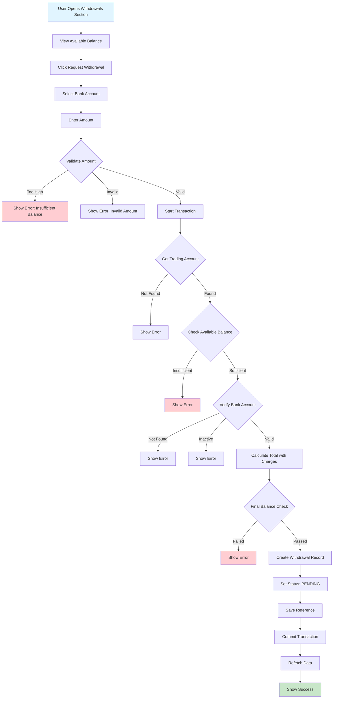

**Validation Logic:**

```typescript
// Get trading account
const tradingAccount = await tx.tradingAccount.findUnique({
  where: { userId }
})

if (!tradingAccount) {
  throw new Error('Trading account not found')
}

// Validate available balance
const totalAmount = withdrawalData.amount + (withdrawalData.charges || 0)
if (tradingAccount.availableMargin < totalAmount) {
  throw new Error('Insufficient available balance for withdrawal')
}

// Verify bank account
const bankAccount = await tx.bankAccount.findFirst({
  where: { 
    id: withdrawalData.bankAccountId,
    userId,
    isActive: true
  }
})

if (!bankAccount) {
  throw new Error('Bank account not found or inactive')
}

// Create withdrawal
const withdrawal = await tx.withdrawal.create({
  data: {
    userId,
    tradingAccountId: tradingAccount.id,
    bankAccountId: withdrawalData.bankAccountId,
    amount: withdrawalData.amount,
    charges: withdrawalData.charges || 0,
    status: WithdrawalStatus.PENDING,
    reference: withdrawalData.reference,
    remarks: withdrawalData.remarks
  }
})
```

**Logging Flow:**

```
💸 [CONSOLE-SERVICE] Creating withdrawal request: { userId, amount: 5000 }
🔄 [CONSOLE-SERVICE] Starting create withdrawal transaction
✅ [CONSOLE-SERVICE] Withdrawal record created: wdl_xyz789
✅ [CONSOLE-SERVICE] Withdrawal request created successfully
```

---

## 6. Profile Update Flow

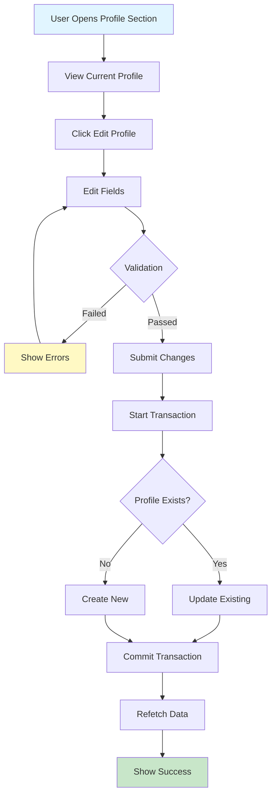

**Transaction Details:**

```typescript
await executeInTransaction(async (tx) => {
  console.log('🔄 [CONSOLE-SERVICE] Starting profile update transaction')
  
  const existingProfile = await tx.userProfile.findUnique({
    where: { userId }
  })
  
  if (existingProfile) {
    console.log('🔄 [CONSOLE-SERVICE] Updating existing profile')
    await tx.userProfile.update({
      where: { userId },
      data: {
        ...profileData,
        updatedAt: new Date()
      }
    })
  } else {
    console.log('🔄 [CONSOLE-SERVICE] Creating new profile')
    await tx.userProfile.create({
      data: {
        userId,
        ...profileData
      }
    })
  }
  
  console.log('✅ [CONSOLE-SERVICE] Profile update transaction completed')
})
```

---

## 7. Transaction Atomic Flow

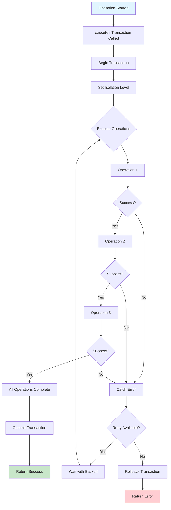

**Retry Logic:**

```typescript
async function executeInTransaction<T>(
  fn: (tx: Prisma.TransactionClient) => Promise<T>,
  options: {
    maxRetries?: number
    timeout?: number
    isolationLevel?: Prisma.TransactionIsolationLevel
  } = {}
): Promise<T> {
  const {
    maxRetries = 3,
    timeout = 10000,
    isolationLevel = Prisma.TransactionIsolationLevel.ReadCommitted,
  } = options

  for (let attempt = 1; attempt <= maxRetries; attempt++) {
    try {
      const result = await prisma.$transaction(
        async (tx) => {
          console.log('💼 [PRISMA-TRANSACTION] Transaction started')
          const res = await fn(tx)
          console.log('✅ [PRISMA-TRANSACTION] Transaction completed')
          return res
        },
        {
          maxWait: 5000,
          timeout,
          isolationLevel,
        }
      )
      
      console.log('🎉 [PRISMA-TRANSACTION] Transaction committed')
      return result
    } catch (error) {
      console.error(`❌ [PRISMA-TRANSACTION] Attempt ${attempt} failed`)
      
      if (attempt < maxRetries) {
        const backoffMs = Math.min(1000 * Math.pow(2, attempt - 1), 5000)
        console.log(`⏳ [PRISMA-TRANSACTION] Retrying after ${backoffMs}ms...`)
        await new Promise(resolve => setTimeout(resolve, backoffMs))
      } else {
        throw error
      }
    }
  }
  
  throw new Error('Max retries exceeded')
}
```

---

## 8. Mobile Navigation Flow

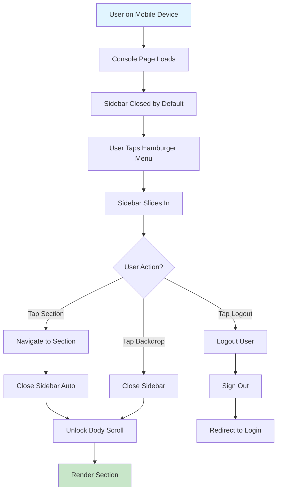

**Mobile Layout Behaviors:**

1. **Sidebar State Management**
   ```typescript
   const [sidebarOpen, setSidebarOpen] = useState(false) // Closed by default
   
   // Close on section change
   useEffect(() => {
     setSidebarOpen(false)
   }, [activeSection])
   
   // Lock body scroll when open
   useEffect(() => {
     if (sidebarOpen) {
       document.body.style.overflow = 'hidden'
     } else {
       document.body.style.overflow = 'unset'
     }
   }, [sidebarOpen])
   ```

2. **Touch Interactions**
   - Spring animations for smooth drawer
   - Backdrop closes sidebar
   - Touch-manipulation CSS for better response
   - No hover effects on mobile

3. **Responsive Breakpoints**
   - Mobile: < 640px (full width, single column)
   - Tablet: 640px - 1024px (2 columns)
   - Desktop: > 1024px (multi-column, persistent sidebar)

---

## 9. Error Handling Flow

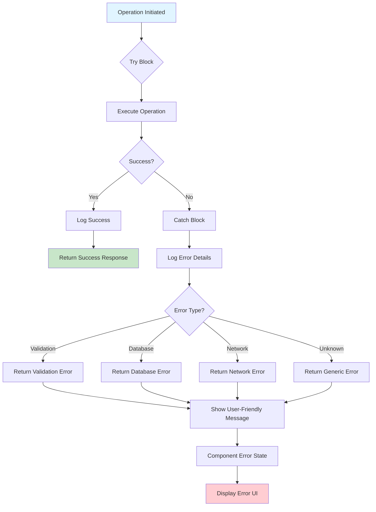

**Error Handling Patterns:**

1. **Service Layer**
   ```typescript
   try {
     console.log('🔄 [SERVICE] Starting operation')
     // ... operation
     console.log('✅ [SERVICE] Operation successful')
     return { success: true, message: 'Success' }
   } catch (error) {
     console.error('❌ [SERVICE] Operation failed:', error)
     console.error('🔍 [SERVICE] Error details:', {
       message: error instanceof Error ? error.message : 'Unknown',
       stack: error instanceof Error ? error.stack : undefined
     })
     return { success: false, message: 'User-friendly error' }
   }
   ```

2. **Component Layer**
   ```typescript
   if (isLoading) {
     return (
       <div className="flex h-64 items-center justify-center">
         <div className="text-muted-foreground">Loading...</div>
       </div>
     )
   }
   
   if (error) {
     return (
       <div className="flex h-64 items-center justify-center">
         <div className="text-center space-y-2">
           <div className="text-xl font-semibold text-destructive">
             Error loading data
           </div>
           <div className="text-sm text-muted-foreground">{error}</div>
         </div>
       </div>
     )
   }
   ```

3. **API Layer**
   ```typescript
   try {
     // ... operation
     return NextResponse.json(result)
   } catch (error) {
     console.error('❌ [API] Error:', error)
     return NextResponse.json(
       { error: 'Internal server error' },
       { status: 500 }
     )
   }
   ```

---

## 10. Real-time Data Refresh Flow

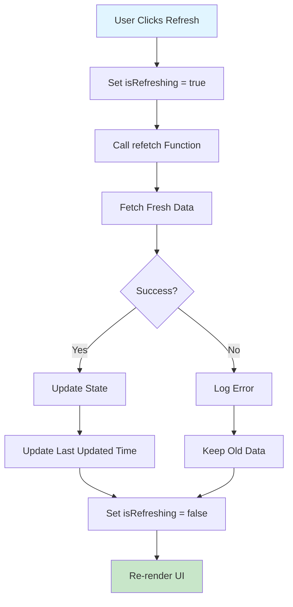

**Auto-Refresh Pattern:**

```typescript
// Auto-refresh every 30 seconds
useEffect(() => {
  const interval = setInterval(() => {
    console.log('🔄 [AUTO-REFRESH] Refreshing data')
    refetch()
    setLastUpdated(new Date())
  }, 30000) // 30 seconds

  return () => clearInterval(interval)
}, [refetch])

// Manual refresh
const handleRefresh = async () => {
  console.log('🔄 [MANUAL-REFRESH] User triggered refresh')
  setIsRefreshing(true)
  try {
    await refetch()
    setLastUpdated(new Date())
    console.log('✅ [MANUAL-REFRESH] Refresh completed')
  } catch (error) {
    console.error('❌ [MANUAL-REFRESH] Refresh failed:', error)
  } finally {
    setIsRefreshing(false)
  }
}
```

---

## Summary

These flow diagrams provide a comprehensive view of all major operations in the Console module:

1. ✅ **Authentication** - Session-based access control
2. ✅ **Data Loading** - Parallel fetching for performance
3. ✅ **Bank Accounts** - CRUD with atomic transactions
4. ✅ **Deposits** - UPI and bank transfer flows
5. ✅ **Withdrawals** - Balance validation and atomic operations
6. ✅ **Profile** - Upsert pattern for user data
7. ✅ **Transactions** - Atomic, retry-enabled operations
8. ✅ **Mobile Nav** - Touch-optimized sidebar
9. ✅ **Errors** - Comprehensive error handling
10. ✅ **Refresh** - Auto and manual data updates

All flows include:
- 📝 Comprehensive logging
- 🔒 Atomic transactions
- ⚡ Performance optimizations
- 📱 Mobile responsiveness
- ❌ Error handling
- ✅ Success feedback