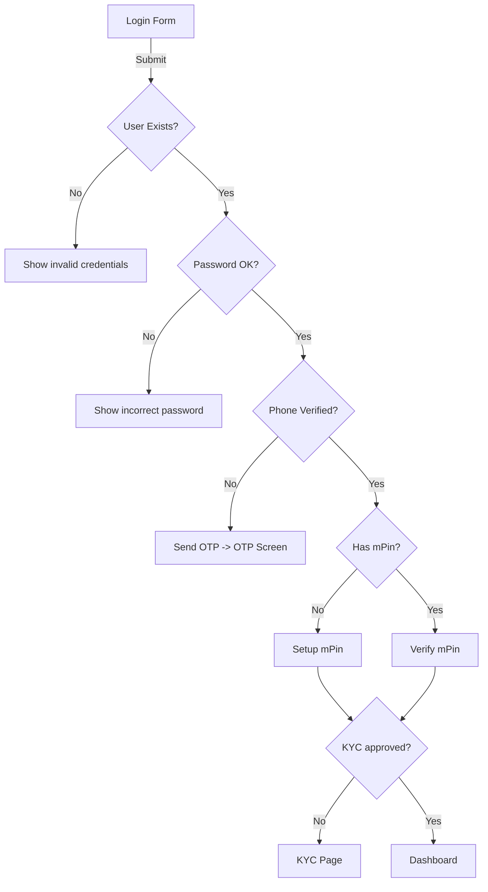

# Login User Flow (UX)

## Steps
- Enter Mobile or Client ID and password
- If phone not verified → OTP verification
- If mPin not set → setup mPin
- If mPin set → verify mPin
- If KYC pending → redirect to KYC
- On success → dashboard

## Messages
- Validation: “Invalid input: … Use your Mobile or Client ID and password.”
- Not found/incorrect: “Invalid credentials. Check Mobile/Client ID and password. If you just registered, verify OTP and set mPin first.”
- Wrong password: “Incorrect password. If forgotten, use Forgot password.”
- OTP: “OTP sent to your mobile (and email). Enter the 6‑digit code to continue.”
- OTP failure: “Failed to send OTP. Tap Resend OTP or try again later.”

## UI Enhancements
- Info banner on login form with guidance
- Password visibility toggle
- Microcopy near identifier explaining Client ID

## Flowchart

