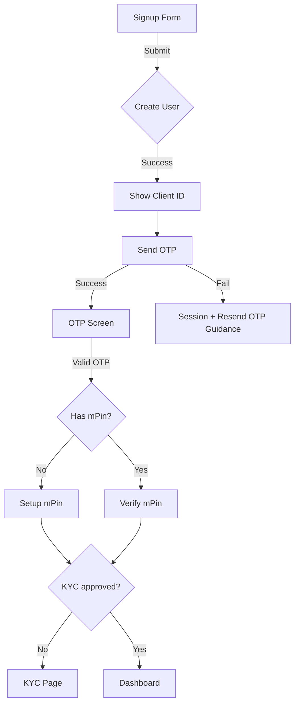

# Registration User Flow (UX)

This document describes the user-facing registration flow and messages.

## Steps
- Fill registration form with name, email, mobile, password
- Submit → account is created and Client ID generated
- Immediate confirmation banner shows: "Account created" and displays Client ID with copy button
- OTP screen appears to verify mobile; timer + resend available
- After OTP:
  - If no mPin → guided to create mPin
  - If mPin exists → verify mPin
  - KYC pending → redirected to KYC
  - On success → dashboard

## Messages
- Success (post-submit): "Registration successful! Your Client ID is <AB1234> ..."
- Banner on OTP screen: "Account created successfully. Your Client ID: <AB1234> [Copy]"
- OTP states: timer, resend, fallback guidance
- Error variants: invalid mobile, email/phone already used, OTP resend failure

## Notes
- Client ID is persisted in in-memory state and shown through OTP/mPin screens when available
- If OTP send fails post-create, user still gets a session to resend OTP

## Flowchart

