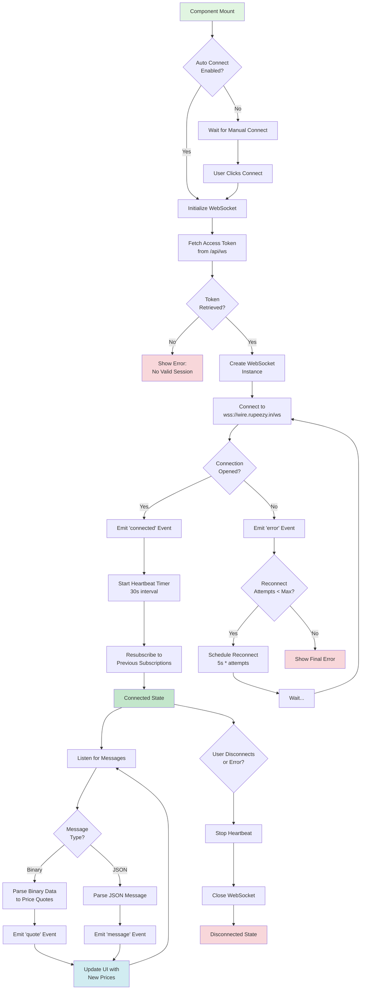
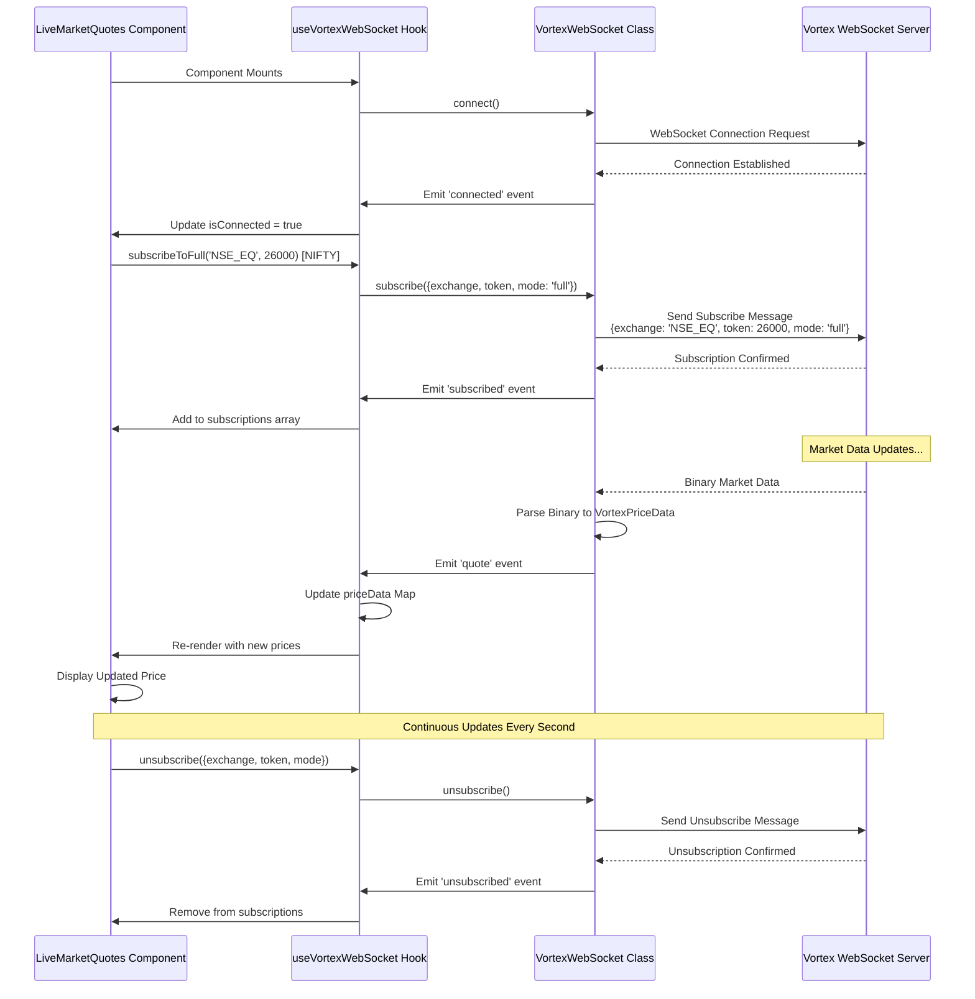
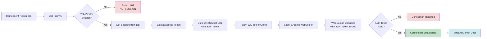
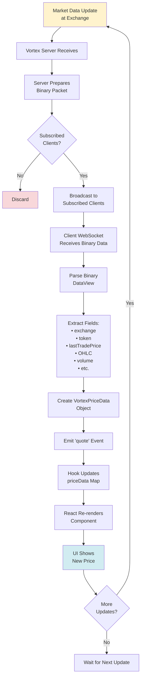
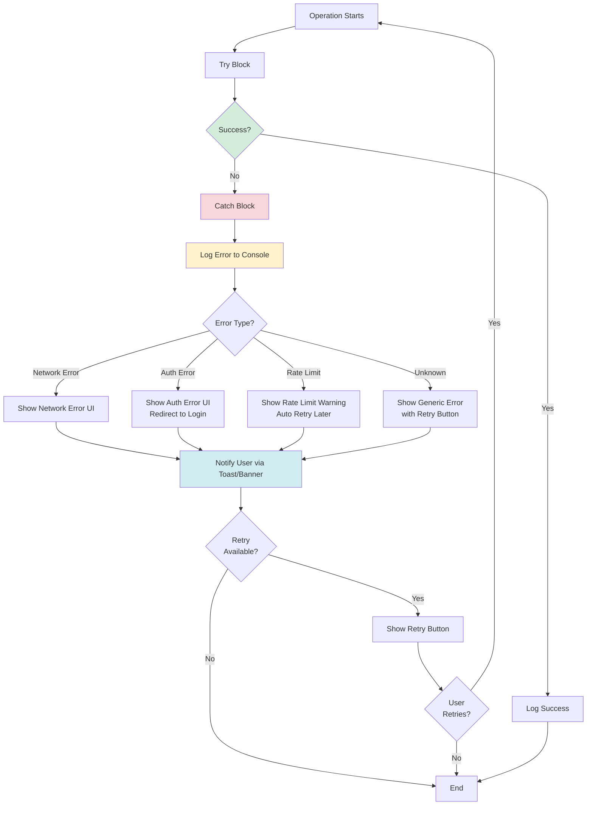

# Vortex WebSocket Integration - Flow Diagrams

## 📊 Overview

This document contains comprehensive flow diagrams for the Vortex WebSocket integration, showing how live market data flows through the system.

---

## 🔄 WebSocket Connection Lifecycle



---

## 📡 Data Subscription Flow



---

## 🏗️ Component Architecture

```
┌─────────────────────────────────────────────────────────────┐
│                     Admin Dashboard Page                     │
│                 /app/(admin)/admin/dashboard                 │
└──────────────────────────────┬──────────────────────────────┘
                               │
                               ▼
┌─────────────────────────────────────────────────────────────┐
│                  WebSocketErrorBoundary                      │
│           • Catches and handles component errors             │
│           • Provides retry mechanism                         │
│           • Logs errors to console                           │
└──────────────────────────────┬──────────────────────────────┘
                               │
                               ▼
┌─────────────────────────────────────────────────────────────┐
│                   LiveMarketQuotes Component                 │
│           • Displays real-time market quotes                 │
│           • Manages UI state and user interactions           │
│           • Renders price cards and connection status        │
└──────────────────────────────┬──────────────────────────────┘
                               │
                               ▼
┌─────────────────────────────────────────────────────────────┐
│                  useVortexWebSocket Hook                     │
│           • Manages WebSocket lifecycle                      │
│           • Handles subscriptions                            │
│           • Provides connection state                        │
│           • Stores price data in Map                         │
└──────────────────────────────┬──────────────────────────────┘
                               │
                               ▼
┌─────────────────────────────────────────────────────────────┐
│                   VortexWebSocket Class                      │
│           • Low-level WebSocket management                   │
│           • Binary data parsing                              │
│           • Heartbeat mechanism                              │
│           • Auto-reconnection logic                          │
│           • Event emission                                   │
└──────────────────────────────┬──────────────────────────────┘
                               │
                               ▼
┌─────────────────────────────────────────────────────────────┐
│              Browser WebSocket API                           │
│         wss://wire.rupeezy.in/ws?auth_token=XXX             │
└─────────────────────────────────────────────────────────────┘
```

---

## 🔐 Authentication Flow



---

## 💹 Real-time Price Update Flow



---

## 🔄 Reconnection Strategy

```
┌─────────────────────────────────────────────────────────────┐
│                  Connection Lost                             │
└──────────────────────────┬──────────────────────────────────┘
                           │
                           ▼
              ┌────────────────────────┐
              │  Stop Heartbeat Timer  │
              └────────────┬───────────┘
                           │
                           ▼
              ┌────────────────────────┐
              │  Check Reconnect Count │
              └────────────┬───────────┘
                           │
                           ▼
              ┌────────────────────────────┐
              │  Count < Max (5)?          │
              └──┬──────────────────────┬──┘
                 │                      │
                Yes                    No
                 │                      │
                 ▼                      ▼
    ┌────────────────────────┐  ┌──────────────┐
    │  Calculate Delay:      │  │  Give Up     │
    │  5000ms * attempts     │  │  Show Error  │
    └────────────┬───────────┘  └──────────────┘
                 │
                 ▼
    ┌────────────────────────┐
    │  Wait (Delay)          │
    │  Attempt 1: 5s         │
    │  Attempt 2: 10s        │
    │  Attempt 3: 15s        │
    │  Attempt 4: 20s        │
    │  Attempt 5: 25s        │
    └────────────┬───────────┘
                 │
                 ▼
    ┌────────────────────────┐
    │  Attempt Reconnect     │
    └────────────┬───────────┘
                 │
                 ▼
    ┌────────────────────────────┐
    │  Success?                  │
    └──┬──────────────────────┬──┘
       │                      │
      Yes                    No
       │                      │
       ▼                      │
┌──────────────┐              │
│  Connected!  │              │
│  Resubscribe │              │
└──────────────┘              │
                              │
                              └──► Increment Count, Try Again
```

---

## 🎯 Error Handling Strategy



---

## 📊 State Management Flow

```
User Action / Event
        │
        ▼
┌──────────────────┐
│  Event Handler   │
│  (callback)      │
└────────┬─────────┘
         │
         ▼
┌──────────────────┐
│  setState()      │
│  or Hook Update  │
└────────┬─────────┘
         │
         ▼
┌──────────────────┐
│  State Updated   │
└────────┬─────────┘
         │
         ▼
┌──────────────────┐
│  React Detects   │
│  State Change    │
└────────┬─────────┘
         │
         ▼
┌──────────────────┐
│  Component       │
│  Re-renders      │
└────────┬─────────┘
         │
         ▼
┌──────────────────┐
│  Virtual DOM     │
│  Diff            │
└────────┬─────────┘
         │
         ▼
┌──────────────────┐
│  Real DOM        │
│  Updated         │
└────────┬─────────┘
         │
         ▼
┌──────────────────┐
│  User Sees       │
│  Updated UI      │
└──────────────────┘
```

---

## 🔍 Key States Tracked

### WebSocket Connection States
- `isConnected: boolean` - Is WebSocket currently connected
- `isConnecting: boolean` - Is connection in progress
- `error: string | null` - Current error message
- `connectionCount: number` - Number of successful connections

### Subscription States
- `subscriptions: VortexSubscription[]` - Active subscriptions
- `priceData: Map<string, VortexPriceData>` - Current price data
- `lastPriceUpdate: VortexPriceData | null` - Last received update

### UI States
- `showDetails: boolean` - Show/hide detailed price info
- `lastUpdateTime: Date | null` - Timestamp of last update

---

## 🚀 Performance Optimizations

1. **Debounced Updates**: Price updates are throttled to prevent excessive re-renders
2. **Memoization**: `useMemo` used for expensive calculations
3. **Callback Memoization**: `useCallback` prevents unnecessary function recreations
4. **Map Data Structure**: Fast O(1) price lookups by exchange:token key
5. **Dynamic Import**: LiveMarketQuotes loaded only when needed
6. **SSR Disabled**: WebSocket component client-side only

---

## 📝 Logging Strategy

All operations are logged with emoji prefixes for easy scanning:

- `🎬` Component lifecycle
- `📊` State updates
- `🔔` Subscriptions
- `💹` Price updates
- `🔄` Reconnections
- `❌` Errors
- `✅` Successes
- `⏱️` Performance metrics
- `🔍` Debugging info

---

## 🎨 UI State Indicators

| State | Badge | Icon | Color |
|-------|-------|------|-------|
| Connecting | "Connecting..." | Spinner | Yellow |
| Connected | "Connected" | Wifi | Green |
| Disconnected | "Disconnected" | WifiOff | Red |
| Error | Error message | AlertCircle | Red |
| Data Loading | Spinner | Loader2 | Gray |
| Data Available | Price info | CheckCircle | Green |

---

## 📌 Important Notes

1. **WebSocket URL**: `wss://wire.rupeezy.in/ws?auth_token={ACCESS_TOKEN}`
2. **Heartbeat Interval**: 30 seconds
3. **Reconnect Strategy**: Exponential backoff (5s, 10s, 15s, 20s, 25s)
4. **Max Reconnect Attempts**: 5
5. **Binary Data Format**: Custom binary protocol from Vortex
6. **Subscription Modes**: `ltp`, `ohlcv`, `full`

---

*Last Updated: 2025-10-07*