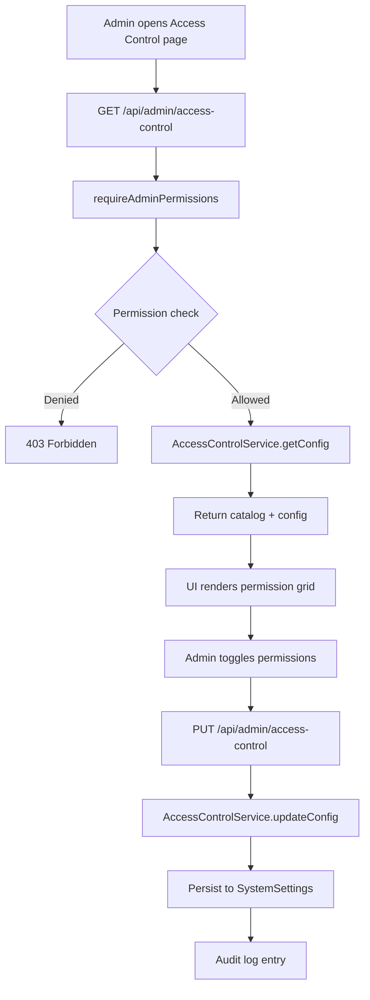

# Module: admin-console

**Short:** Admin console UI with access control management.

**Purpose:** Provide administrators a secure dashboard for operations, including RBAC management.

**Files:**
- `header.tsx` — loads admin session, role, and permissions
- `sidebar.tsx` — navigation gated by permissions
- `access-control.tsx` — RBAC management UI
- `app/(admin)/admin-console/access-control/page.tsx` — access control page entry
- `app/api/admin/access-control/route.ts` — RBAC config API
- `lib/services/admin/AccessControlService.ts` — RBAC config persistence
- `MODULE_DOC.md` — this file

**Flow diagram (RBAC management):**

**Dependencies:**
- `lib/rbac` for permission catalog and guard
- `lib/services/admin/AccessControlService`
- `@/auth` for session resolution

**APIs:**
- `GET /api/admin/access-control` — fetch role permissions and catalog
- `PUT /api/admin/access-control` — update role permissions
- `GET /api/admin/me` — session user + permissions for UI gating

**Env vars:** none.

**Tests:** `tests/admin/access-control-guard.test.ts`

**Change-log:**
- 2026-01-15: Added RBAC access-control UI, restricted permission gating, and audit logging.
