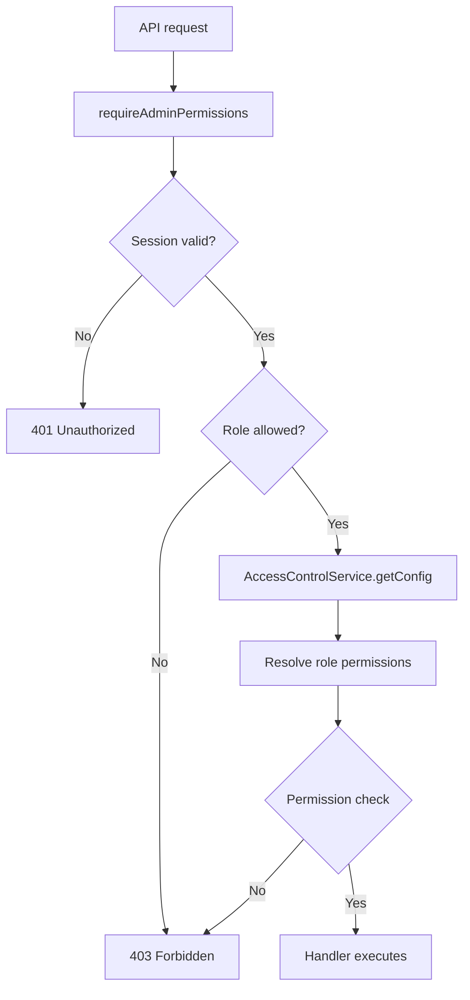

# Module: rbac

**Short:** Central RBAC catalog and permission guard.

**Purpose:** Provide consistent permission definitions and enforcement for admin APIs.

**Files:**
- `permissions.ts` — permission catalog, defaults, restrictions
- `admin-guard.ts` — `requireAdminPermissions` helper
- `index.ts` — public exports
- `MODULE_DOC.md` — this file

**Flow diagram (permission enforcement):**

**Dependencies:**
- `lib/services/admin/AccessControlService`
- `@/auth` for session validation

**APIs:** Used by `app/api/admin/**` and `app/api/super-admin/**` routes.

**Env vars:** none.

**Tests:** `tests/admin/access-control-guard.test.ts`

**Change-log:**
- 2026-01-15: Added super-admin financial manage permission and RBAC exports.
