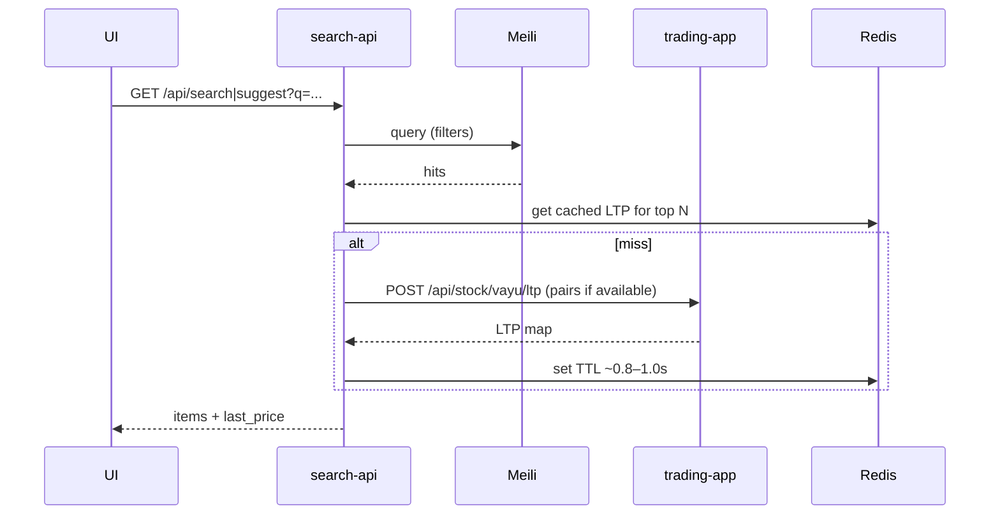

# Milli-search API – Frontend Quick Guide

Minimal reference for search and suggest in the trading app.

Base - https://marketdata.vedpragya.com

## Endpoints
- Base: `https://marketdata.vedpragya.com` (client-side via axios)
- GET `/api/search`
- GET `/api/search/suggest`
- GET `/api/search/filters`
- GET `/api/search/stream` (SSE ~1s for LTP; auto-closes ~30s)
- POST `/api/search/telemetry/selection` (best-effort query→symbol learning)

## Query params (search & suggest)
- q: string (required)
- limit: number (search: ≤50, suggest: ≤20)
- exchange, segment, instrumentType: string (optional)
- mode: eq|fno|curr|commodities (optional)
- expiry_from, expiry_to: ISO-like string (YYYY-MM-DD)
- strike_min, strike_max: number
- ltp_only: boolean (true → only items with valid last_price)

## Response fields (items)
- instrumentToken, symbol, tradingSymbol, companyName
- exchange, segment, instrumentType
- expiryDate, strike, tick, lotSize
- ticker (e.g., NSE_FO_RELIANCE)
- isDerivative (bool), underlyingSymbol (derivatives)
- last_price (hydrated), timestamp (envelope)

## Behavior
- Hydration: TTL ~0.8–1.0s cache; token-based LTP when available.
- Hydrate top-10 by default; when `ltp_only=true`, hydrate up to top-50 for better coverage.
- Filters apply to Meili query; `ltp_only` filters results after hydration.
- SSE: emits every ~1s, auto-closes ~30s, max 100 tokens per session.

## Examples
```bash
# Suggest with LTP and FO-only (external)
curl "https://marketdata.vedpragya.com/api/search/suggest?q=RELI&ltp_only=true&limit=10"

# Search options in a date/strike window with LTP (external)
curl "https://marketdata.vedpragya.com/api/search?q=NIFTY&instrumentType=OPTIDX&expiry_from=2025-10-01&expiry_to=2025-10-31&strike_min=20000&strike_max=22000&ltp_only=true&limit=30"

# Facets for filters UI (external)
curl "https://marketdata.vedpragya.com/api/search/filters?segment=NSE"

# SSE stream for LTP by tokens (external)
curl -N "https://marketdata.vedpragya.com/api/search/stream?tokens=738561,26000&ltp_only=true"

# SSE stream for LTP by query (top hits hydrated, external)
curl -N "https://marketdata.vedpragya.com/api/search/stream?q=RELIANCE&ltp_only=true"

# Log a user selection for synonym learning (best effort)
curl -X POST "$BASE/api/search/telemetry/selection" \
  -H "Content-Type: application/json" \
  -d '{"q":"reli","symbol":"RELIANCE","instrumentToken":738561}'
```

## Flow


## Notes
- Endpoints may return empty arrays; handle gracefully in UI.
- Use `ltp_only=true` for user-facing suggestions to show live instruments.
- `ticker` is handy for display or quick lookups.
- Telemetry: POST `/api/search/telemetry/selection` with `{ q, symbol, instrumentToken }` after user picks a result.

## Suggested enhancements
- SSE stream for periodic re-hydrate (e.g., 1s) on active result set.
- Popular/trending endpoint with cached LTP.
- Synonym expansion service (auto-learn from user queries).
- Underlying/derivative linking (e.g., show options for selected equity).
- Client hint for mode (eq/fno/curr/commodities) to pre-filter.
